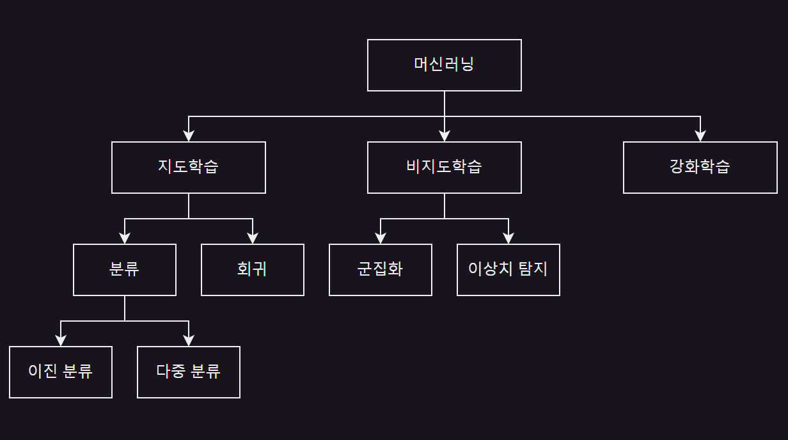
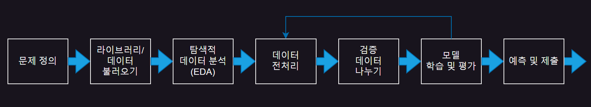
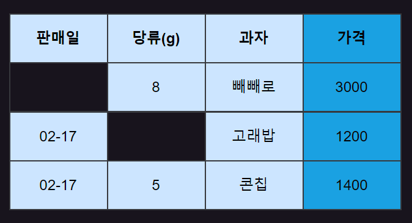
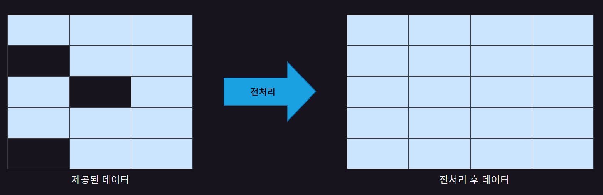
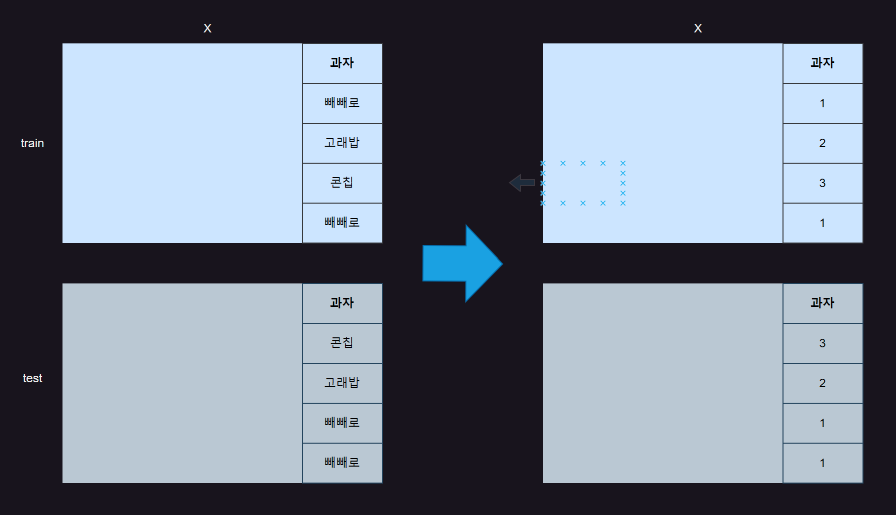
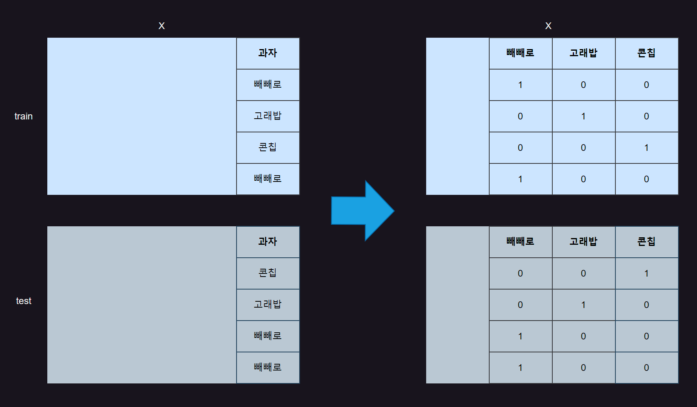
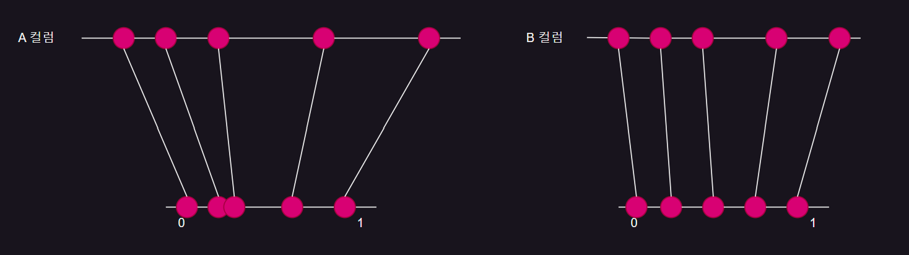
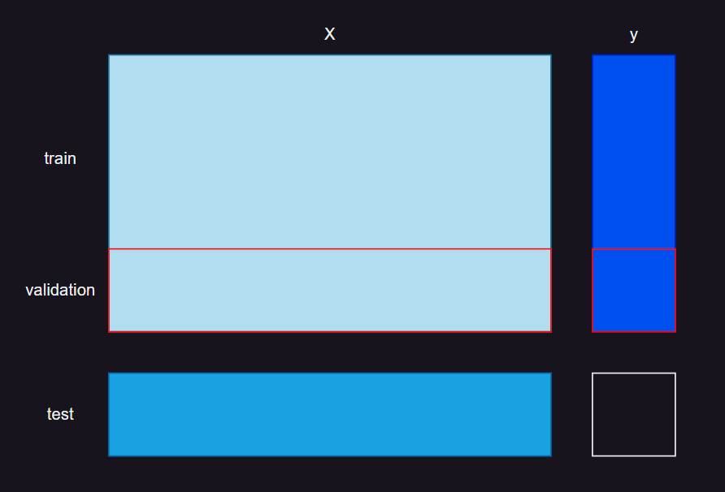
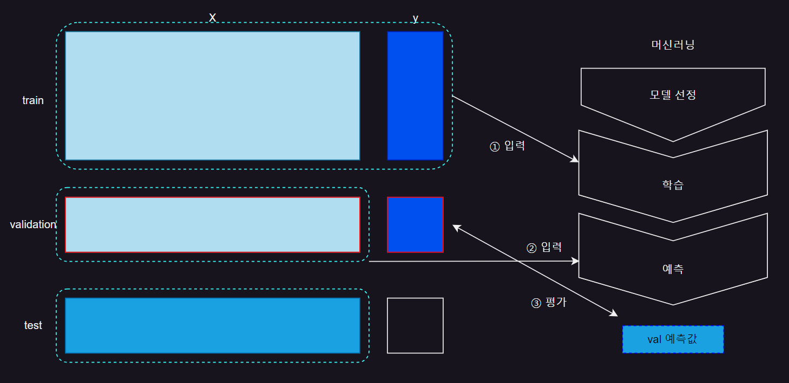
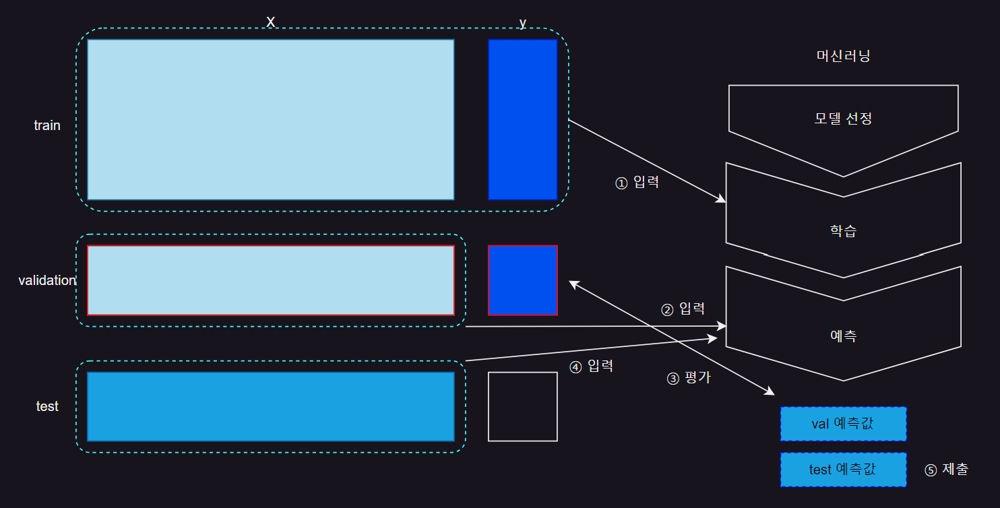

# CHAPTER01 머신러닝 기초
- 머신러닝 : 데이터를 학습하고 패턴을 발견해 의사결정을 하는 인공지능의 한 분야

  - 데이터 학습 방식
 
    - 지도학습(Supervised Learning)
   
    - 비지도학습(Unsupervised Learning)
   
    - 강화학습(Reinforcement Learning)

 

|머신러닝|
|-|
||

 

SECTION01 지도학습, 비지도학습, 강화학습
---
### 01. 지도학습
- 정답이 있는 데이터셋이 있을 때 사용

- 데이터셋은 학습(훈랸) 데이터와 정답(label)으로 구성

  - ex) 킥보드 대여 수요량 예측
 
    - 날씨, 습도, 주말 여부, 계절, 풍속, 시간과 킥보드 수요량(label) 데이터 학습
   
    - 새로운 데이터가 있을 때 수요량 예측 가능
   
 

### 02. 비지도학습
- 정답을 모를 때 사용

- 데이터의 숨겨진 구조나 패턴 발견 가능

  - ex) 고객을 N개로 세분화
 
    - 고객 데이터의 특징에 따라 군집화(클러스터링) 진행
   
    - 각 군집된 고객에게 다른 마케팅 전략 사용 가능

 

### 03. 강화학습
- 환경과 보상을 기반으로 보상을 최대화하는 최적의 행동을 학습

  - ex) 구글의 알파고와 같이 바둑이라는 환경에서 최적의 선택을 할 수 있도록 학습
 
 

---

 

SECTION02 분류와 회귀
---
- 지도학습

  - 분류 : 범주(클래스) 예측
 
  - 회귀 : 연속적인 값 예측

 

### 01. 분류(Classification)
- 주어진 데이터의 특성을 학습해 새로운 데이터가 어떤 범주(클래스)에 속하는지 예측

  - 이진 분류(Binary Classification) : 합격, 불합격 두 가지 범주로 구분된 데이터
 
  - 다중 분류(Multiclass Classification) : A, B, C 와 같이 3개 이상

- 각 클래스가 선택될 확률 예측

  - ex) 모델이 격 확률 98%, 불합격 확률 2% 예측한다면, 가장 확률이 높은 '합격'을 예측 결과로 결정

 

### 02. 회귀(Regression)
- 연속적인 값 예측

  - 집값, 주가, 판매량, 수요량 등
 
- 예측 결과값이 연속성이 있는지 확인하면 분류와 회귀 쉽게 구분 가능

  - ex) 빅데이터 분석기사 응시 결과
 
    - 분류 : '합격', '불합격' 클래스만 존재
   
    - 회귀 : 0점 ~ 100점 예측 가능

 

---

 

SECTION03 정형 데이터
---
- 머신러닝은 다양한 데이터를 학습(training) 가능

  - 비정형 데이터
 
    - 이미지, 자연어 등
 
  - 정형 데이터
 
    - 이커머스 데이터 : 상품명, 카테고리(대), 카테고리(소), 판매량, 판매금액, 등록일 등
   
    - 고객 데이터 : 이름, 나이, 성별, 연락처, 이메일, 가입기록, 출석기록 등
   
    - 금융 데이터 : 종목 코드, 종목명, 날짜, 종가, 시가, 거래량 등
   
    - 의료 데이터 : 이름, 나이, 성별, 혈압, 심박수, 혈당 수치, 간 수치 등

- 표 현태의 정형 데이터 형식 : csv(comma-separated values)

  - 쉼표(comma)로 구분한 데이터

 

---

 

SECTION04 머신러닝 프로세스
---

|머신러닝 프로세스|
|-|
||

 

### 01. 문제 정의
- 풀어야 할 문제가 무엇인지 명확하게 파악

#### (1) 제공된 데이터 형식과 목록
- 제공된 데이터는 3개 도는 2개

|데이터 2개|데이터 3개|
|-|-|
|- train(= X_train & y_train)  - test(=X_test)|- X_train  - y_train  - X_test &nbsp;&nbsp;&nbsp;&nbsp;&nbsp;&nbsp;&nbsp;&nbsp;&nbsp;&nbsp;&nbsp;&nbsp;&nbsp;&nbsp;&nbsp;&nbsp;&nbsp;&nbsp;&nbsp;&nbsp;&nbsp;&nbsp;&nbsp;&nbsp;&nbsp;&nbsp;&nbsp;&nbsp;&nbsp;&nbsp;&nbsp;|

 

#### (2) 예측 컬럼 설명
- 예측해야 할 값은 컬럼이 무엇인지 알려줌

  - 모든 컬럼에 대한 설명이 없을 수도 있음
 
 

#### (3) 문제 확인
- 어떤 예측 모형을 만들고 어떤 형태의 예측값을 제출하는지 설명

  - 분류 또는 회귀 중 어떤 문제인지 알아야 함
 
|분류|회귀|
|-|-|
|- 무엇을 에측하는 데이터인지 확인  - 이진 분류 or 다중 분류  - 예측값 : 확률값 or 범주(클래스)|- 무엇을 예측하는 데이터인지 확인  - 예측값 : 연속형|

 

#### (4) 평가 방식
- 문제에서 평가하고자 하는 평가지표 확인

- 평가지표를 통해서도 분류 또는 회귀 구분 가능

  - 분류 : 정확도(Accuracy), 정밀도(Precision), 재현율(Recall), F1 스코어(F1 Score), ROC-AUC 등
 
  - 회귀 : MSE, MAE, 결정 계수(R-squared), RMSE, MSLE, RMSLE, MAPE 등

 

#### (5) 최종 제출할 데이터 샘플
- 최종 제출할 데이터 샘플 확인

- 제출 양식

  - 예측값만 제출
 
  - id 와 예측값을 함께 제출
 
- 최종 제출할 데이터를 요청사항과 다르게 제출하면 감정
 
|예측값만 제출|id 와 예측값 함께 제출|
|-|-|
|pred 0.342 0.345 0.662 ...|id.gender 2100,0.342 2101.0.345 2102,0.662 ...|

 

### 02. 라이브러리 및 데이터 불러오기
- 판다스 라이브러리를 통해 제공된 데이터 불러오기

|-|
|-|
||
|- y_train : y, label(레이블), target(타깃) ⇒ y 는 소문자 사용하는 것이 관례  - 예측 : 머신러닝을 통해 찾을 값|

- ex) 배달 앱

  - ① X_train 에는 주문자, 주문 시간, 메뉴, 가격, 거리
 
  - ② y_train 에는 도착 시간(분)
 
  - ①, ② 데이터로 만든 머신러닝 모델을 통해 새로운 주문은 ③ X_test 데이터의 ④ 예측 도착 시간(분) 구할 수 있음
 
  - 작업형2에서는 ④ 예측값을 잘 만드는 것이 목표

 

### 03. 탐색적 데이터 분석(EDA)
|-|
|-|
||

 

#### (1) 데이터 크기 확인
- 주어진 데이터의 행과 열의 크기 확인

- 표에서 행(row)은 3개, 열(column)은 4개인 데이터

 

#### (2) 데이터 샘플 확인
- 데이터 샘플 확인

- 숫자, 문자, 날짜 등 어떤 데이터를 담고 있는지 확인 가능

 

#### (3) 컬럼(열, 변수)별 자료형 확인
- 컬럼별 자료형 확인

- 숫자 형태와 문자 형태가 있음

  - object 형태 : 판매일, 과자
 
  - int 형태 : 당류, 가격

 

#### (4) 기초 통계 확인
- 수치형 데이터 기초 통계(최대값, 최소값, 평균값 등)와 범주형 데이터 기초 통계(빈도) 확인

 

#### (5) 결측치 확인
- 결측치 : 값이 누락된 데이터

- 표에서 글자가 없는 부분을 결측치라고 가정한다면 2개의 누락값 찾을 수 있음

 

#### (6) 이상치 확인
- 빅분기 실기 시험에서는 시각화가 지원되지 않고 해당 데이터에 도메인 지식이 없다면 이상치를 찾는데 어려움

- ex) 나이가 음수값처럼 누구나 알 수 있는 일반적인 상식 외에는 이상치 기준을 안내해주거나 출제 가능성이 낮음

 

#### (7) y(타깃, 레이블) 컬럼
- 가격, 매출, 수요량 등 연속형 숫자를 예측하는 회귀 문제

- 지연 여부, 스팸 여부 등의 2개의 클래스로 구분되는 문제면 이진 분류 문제

- 3개 이상의 클래스로 구분되는 문제면 다중 분류 문제

- 회귀 : y 컬럼의 기초 통계값 확인

- 분류 : 각 클래스별 빈도 확인

 

#### (8) 범주형/수치형 컬럼
- 수치형 데이터 : 당류, 가격

- 범주형 데이터 : 과자

- 시계열 데이터 : 판매일

 

### 04. 데이터 전처리
- 탐색적 데이터 분석(EDA) 단계에서 결측 데이터와 범주형 데이터가 발견

  - 결측치 처리와 인코딩 필요
 
  - 이상치 처리와 스케일링은 선택
 
- 데이터 전처리 과정에서 중요한 점은 test 데이터의 행을 삭제하면 X

  - test 데이터 행 삭제를 제외한 모든 전처리 과정은 train 데이터와 test 데이터 모두 적용

 

|-|
|-|
||

 

#### (1) 결측치
- 누락값이 있는 데이터(행) 또는 컬럼(열)을 삭제하거나 평균값, 중앙값, 최빈값 등으로 채울 수 있음

- 빅분기 실기 시험에서 주어지는 데이터는 작은 데이터

- 결측치가 너무 많지 않다면 삭제보다는 채우는 것이 좋음

- 삭제 또는 채움의 기준은 머신러닝 모델 성능 평가 결과에 따름

 

#### (2) 이상치
- 도메인 지식이 있으면 그 도메인에서 나올 수 없는 값이나 IQR(Interquartile Range) 사용해 이상치 찾기 가능

- 실제 데이터에서 아래 한계(Q1 - 1.5 * IQR)와 상위 한계(Q3 + 1.5 * IQR) 적용하면 많은 데이터가 이상치로 판단

- 작업형2 문제에서는 명백한 이상치가 아니라면 이상치를 탐지해 제거하지 않아도 40점 받는데 충분

  - 문제에서 명시된 이상치가 아니면 처리하지 않는 것을 추천

 

#### (3) 인코딩
- 머신러닝에 데이터를 넣을 때는 일반적으로 숫자로만 가능

- 범주형 변수는 수치형 변수로 변경 필요 (인코딩)

- 인코딩 방벙

  - 레이블 인코딩(Label Encoding)
 
    - 각 범주(카테고리)를 숫자로 매핑하는 인코딩 방법
   
    - ex) 빼빼로 1, 고래밥 2, 콘칩 3 으로 변환
   
  - 원-핫 인코딩(One-Hot Encoding)
 
    - 각 범주에 대해 새로운 컬럼을 만들고, 새로운 컬럼에 해당하면 1, 아니면 0 입력
   
    - ex) 빼빼로, 고래밥, 콘칩이라는 새로운 컬럼 생성 후 1 또는 0 할당
   
      - 판다스 버전에 따라 0, 1 대신 True(1), False(0) 나타나기도 함

 

|레이블 인코딩|원-핫 인코딩|
|-|-|
|||

- 데이터를 train 과 test 로 따로 그린 이유

  - 데이터 전처리를 진행할 때는train 데이터뿐만 아니라 test 데이터도 동일하게 진행해야 하기 때문

 

#### 💡 test 에 하면 안되는 전처리
- train 에서 행(레코드)을 삭제하더라도 test 에는 적용하면 안됨

  - ex) train 에서 이상치라고 판단해 삭제한 행(레코드)이 있고 test 에서도 유사한 이상치가 발견되어 행(레코드) 1개 삭제했다고 가정
 
    - 최종적으로 test 를 예측한 결과값도 1개가 누락
   
    - test 의 개수가 맞지 않아 0점 처리
   
    - 따라서 test 데이터의 행(레코드)은 절대 삭제하면 안됨
   
    - 컬럼은 train 과 같이 삭제/추가해도 OK

 

#### (4) 스케일링
- 데이터의 값을 특정 범위로 조정

  - 금액 데이터가 0부터 10억까지 있다면 이를 0부터 1 사이 값으로 변경하는 것
 
 

|-|
|-|
||

 

- 스케일링하는 이유

  - A 컬럼(예: 원화)에는 100 ~ 100,000 사이 데이터 존재
 
  - B 컬럼(예: 달러)에는 0 ~ 100 사이 데이터 존재
 
  - 스케일링을 통해 각 컬럼(변수)을 같은 범위(0~1)로 맞춤으로써 모델 성능 향상
 
- 트리 기반 모델(의사결정나무, 랜덤포레스트, Xgboost, LightGBM 등)

  - 상대적으로 크게 영향을 받지 않아 스케일링하더라도 큰 효과 보기 어려움
 
- 선형 모델(선형 회귀, 로지스틱 회귀 등)

  - 모델 예측에 긍정적인 영향 줄 수 있음

 

#### (5) y(label, target)
- 회귀 문제 : y 데이터는 숫자(연속형)

- 분류 문제 : y 데이터는 숫자(클래스) or 문자

 

### 05. 검증 데이터 나누기

|-|
|-|
||

- 머신러닝 모델을 학습시키기 전에 자체 평가를 위해 학습용(train) 데이터 중 일부를 검증(validation)용 데이터로 분리

- 검증용 데이터에는 예측한 결과값을 평가하기 위해 X 데이터뿐만 아니라 y 데이터도 함꼐 필요

- 데이터 크기가 작을 때는 검증 데이터를 상대적으로 덪 가게 가져가기도 함

  - 반드시 검증 데이터를 분리해야 하는 것은 아님
 
 

### 06. 모델 학습 및 평가
- 작업형2에서 활용할 머신러닝 모델은 대부분 사이킷런에서 불러옴

- 모델 선정 → 학습(훈련) → 예측 순으로 진행

 

|-|
|-|
||

 

#### (1) 모델 선정
- 사용하고자 하는 머신러닝 모델 선정

- 분류/회귀 문제에 따라 모델이 달라질 수 있음

 

#### (2) 학습(훈련)
- ① 전처리된 train 데이터를 머신러닝 학습용으로 넣고 학습(training)해 모델 만듦

 

#### (3) 예측
- ② 만들어진 모델로 예측 진행

  - 검증(validation) 데이터 중 X_validation 데이터만 입력값으로 사용
 
- ③ 모델이 예측한 결과값과 실제값(y_validation)을 비교해 점수 확인

- baseline(베이스라인) : 첫 번째 점수까지 계산된 간단한 코드

  - 베이스라인을 기준으로 전처리를 반복하면서 모델의 성능 향상시킴
 
  - 시험에서는 평가 점수에 대한 가이드라인이 없음
 
    - 수험생이 첫 번째로 만든 베이스라인 모델보다 좋은 성능이 나오도록 모델 개선

 

### 07. test 데이터 예측 및 제출
- 앞 단계에서 진행한 예측은 검증(validation) 데이터에 대한 예측

- 최종적으로 예측하고 제출해야 하는 데이터는 test 

 

|-|
|-|
||

 

- ①, ②, ③ 단계에서 검증 데이터를 활용해 평가

  - 최종적으로 사용할 모델 결정
 
- ④ 결정한 모델에 test 데이터를 넣어 예측 진행

- ⑤ 예측한 결과값을 작업형2 문제에서 요구하는 csv 파일 형태로 변경해 제출

 
