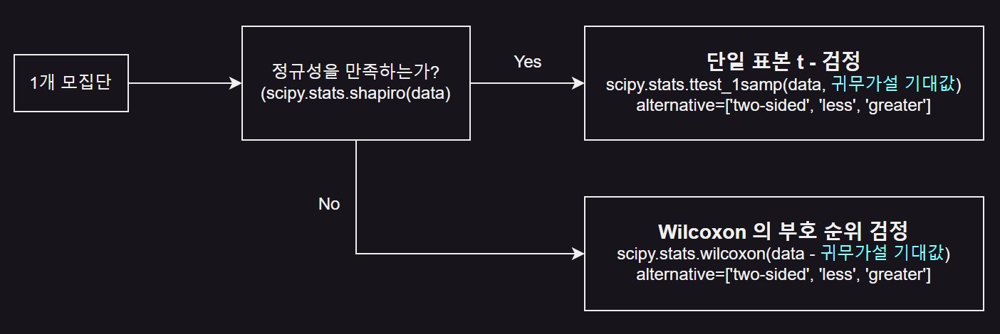
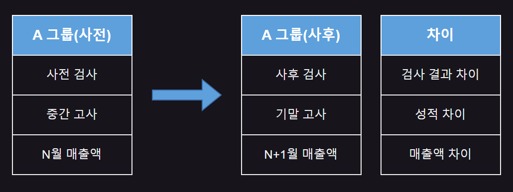
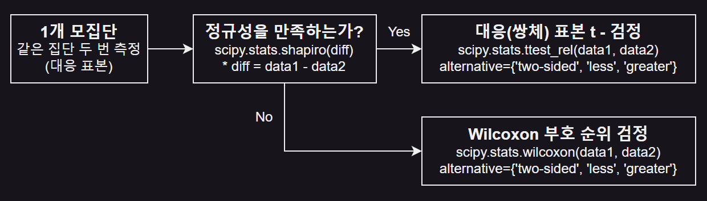
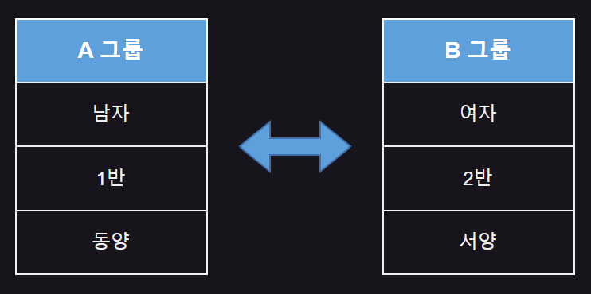
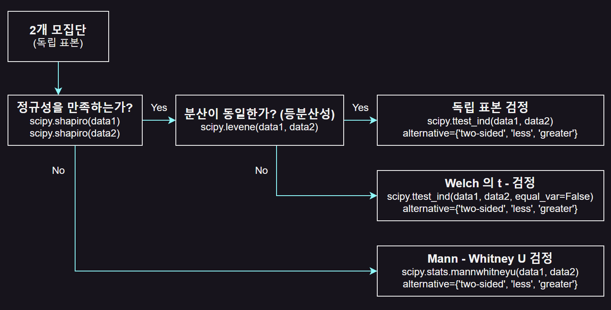

# CHAPTER01 가설검정
- 어떤 주장을 제기하고, 그 주장이 통계적으로 유의미한지 판단하기 위해 사용

  - 불확실한 상황 속에서 통계적 원리를 통해 결론 찾음
 
- 모든 데이터를 조사하고 분석하면 가설검정 필요 X

- 엄청난 비용과 시간이 들어가는 일에는 가설검정 이용하는 것이 효율적

  - ex) 대한민국 인구 전체 조사
 
    - 모집단(population) : 대한민국 인구 전체
   
    - 표본(sample) : 모집단을 알기 위해 관찰한 데이터의 일부
   
    - 표본 데이터를 통해 가설검정 진행
   
- 시험에서 주어진 데이터는 모집단으로부터 추출한 표본 데이터

<br>

SECTION01 가설검정의 이해
---
### 01. 귀무가설과 대립가설
- 통계적 가설검정의 두 가지 가설

  - 귀무가설(null hypothesis, H₀)
 
    - 기존에 알려진 사실
   
      - ex) '아메리카노 한 잔의 원두는 20g 이 아니다' 라고 주장할 때 귀무가설
     
        - : &nbsp; '아메리카노 한 잔의 원두는 20g 이다'
 
  - 대립가설(alternative hypothesis, H₁)
 
    - 입증하고자 하는 가설
      
      - ex) '아메리카노 한 잔의 원두는 20g 이 아니다' 라고 주장할 때 대립가설
     
        - : &nbsp; '아메리카노 한 잔의 원두는 20g 이 아니다'

<br>

### 02. 가설검정의 결론
- 귀무가설과 대립가설이 존재할 때 가설검정의 결과 : 귀무가설 또는 대립가설 채택

  - 귀무가설이 옮다고 밝혀진 경우
 
    - 가설검정의 통계적인 결론은 '귀무가설을 기각하지 못한다'
   
      - 귀무가설이 기존에도 사실이었으므로 '채택한다' 가 아닌 '기각하지 못한다' 사용
   
  - 대립가설이 옳다고 밝혀진 경우
 
    - 가설검정의 통계적인 결론은 '귀무가설을 기각하고 대립가설을 채택한다'
   
- 시험에서는 명확한 답변 작성 필요

  - 귀무가설 기준으로 채택 및 기각을 물으면 '귀무가설 채택' or '귀무가설 기각' 으로 기재

<br>

### 03. 가설검정 프로세스
- 가설 검정 방법

  - 기각역 이용하는 방법
 
  - 유의확률 이용하는 방법
 
<br>

#### (1) 유의확률 이용하는 방법
- 통계적 가설 설정(귀무가설과 대립가설)

  - 검정하고자 하는 가설 설정
 
    - 귀무가설(H₀) : 기존에 알려진 또는 일반적인 사실(주장)
    
    - 대립가설(H₁) : 입증하고자 하는 가설(주장)

- 유의수준 결정

  - 유의수준 : 귀무가설을 기각하기 위해 필요한 기준값
 
    - 일반적으로 0.05 또는 0.01 같은 값 사용
   
    - 검정 결과를 해석하는 데 중요한 역할
   
- 검정 통게량 및 유의확률 계산

  - 표본 데이터의 검정 통계량 계산
 
    - 검정 통계량 : 가설을 평가하기 위해 사용되는 값
   
    - 검정통계량을 사용해 유의확률(p-value) 계산
   
- 결과 도출

  - 유의확률 < 유의수준 : 귀무가설 기각
 
  - 유의확률 > 유의수준 : 귀무가설 채택

<br>

---

<br>

SECTION02 단일 표본 검정
---
### 01. 단일 표본 검정(One sample t-test)
- 어떤 집단의 평균이 특정 값과 유의미하게 다른지를 검정하는 통계 방법

<br>

> ex
```
  영화관에서 판매하는 팝콘의 무게가 120g 으로 알려져 있다.
  그런데 판매할 때마다 무게가 다른 것 같아 평균적으로 무게가 120g 인지 확인하고자 한다.
```
- 단일 표본 검정 사용 가능

<br>

### 02. 표본
- 시험에서 주어진 데이터는 표본 데이터

  - 평균 표본은 구하라는 문제가 출제된다면 주어진 데이터를 갖고 평균 구하기

<br>

> ex
```
  판매할 때마다 무게를 모두 측정해 기록하는 것은 비효율적이므로 손님들이 팝콘을 구매할 때 무작위로 선택해 무게 측정
```
- 표본 = 선택된 팝콘

<br>

### 03. t-test(t-검정)
- 표본의 크기, 표본의 평균, 표본의 표준편차 등을 활용해 귀무가설과 다른지 t-test(t-검정) 수행

  - ex) 기존에 알려진 120g 과 다른지 t-test 수행

- t-test(t-검정) 결과는 p-value(p-값) 주어짐

  - 이 값이 얼마나 작은지에 따라 판단 가능
 
    - 유의수준보다 작으면 통계적으로는 유의미하게 다르다고 결론
   
    - ex) 유의수준(ex 0.05)보다 작으면 평균적으로 120g 이 아니라고 할 만한 충분한 근거가 있다는 의미

<br>

> 단일 표본 검정에서는 scipy.stats 의 ttest_1samp() 활용
```python
  ttest_1samp(a, popmean, alternative)
```
- a : 모집단에서 뽑은 표본 데이터

- popmean : 비교하려는 모집단의 평균 또는 기대값

- alternative(대립가설 정의)

  - μ > μ₀ : greater, 주어진(알려진) 특정 값보다 평균이 크다
 
  - μ < μ₀ : less, 주어진(알려진) 특정 값보다 평균이 작다
 
  - μ != μ₀ : two-sided(기본값), 주어진(알려진) 특정 값과 표본의 평균이 같지 않다

<br>

#### 💡 μ(뮤)와 μ₀(뮤 제로) 차이
- μ(뮤) : 통계학에서 주로 모집단의 평균을 의미하는 기호

  - 모집단의 특성을 추정할 때 사용
 
- μ(뮤)와 μ₀(뮤 제로)는 모집단의 평균과 귀무가설에서 주장하는 모집단의 평균 차이 의미

  - μ(뮤) : 팝콘의 실제 평균 무게
  
  - μ₀(뮤 제로) : 기존에 알려진 무게(ex. 120g)

<br>

#### ✏️ 문제
> 영화관에서 판매하는 팝콘 라지 사이즈의 무게는 일반적으로 120g 으로 알려져 있다.<br>
> 이제 이 데이터를 갖고 t-test 를 수행한다.<br>
> 가설검정 프로세스 순서로 풀어본다.

```python
  import pandas as pd
  df = pd.DataFrame({
      'weights' : [122, 121, 120, 119, 125, 115, 121, 118, 117, 127,
                   123, 129, 119, 124, 114, 126, 122, 124, 121, 116,
                   120, 123, 127, 118, 122, 117, 124, 125, 123, 121]
  })
```
- 통계적 가설 설정(귀무가설과 대립가설)

  - 귀무가설 : '기존에 알려진 사실' or '변화가 없음' or '차이가 없음' 을 주장하는 가설
 
    - μ = μ₀
 
    - 팝콘 라지 사이즈의 평균 무게는 120g 이다
   
  - 대립가설 : '기존에 알려진 사실과 다름' or '변화가 있음' 등 귀무가설과 반대의 주장을 하는 가설
 
    - μ != μ₀
 
    - 팝콘 라지 사이즈의 평균 무게는 120g 이 아니다
   
- 유의수준 결정

  - 유의수준은 별도 안내가 없다면 0.05 를 기준으로 함
 
- 검정 통계량과 유의확률

  - 단일 표본 검정을 수행하는 ttest_1samp(표본 데이터, 알려진 평균값) 함수
 
    - 검정 통계량과 유의확률(p-value) 반환

- 결과 도출

  - p-value < 유의수준(0.05)
 
    - 팝콘 라지 사이즈의 평균 무게가 120g 이 아니라는 증거가 있다는 의미
   
    - 귀무가설 기각, 대립가설 채택
   
  - p-value > 유의수준(0.05)
 
    - 팝콘 라지 사이즈의 평균 무게가 120g 이라는 기존 가설을 기각할 충분한 증거를 얻지 못했다고 판단 가능
   
    - 귀무가설 채택, 대립가설 기각
   
  - 단일 표본 검정은 scipy 라이브러리 활용
 
    - ttest_1samp() 함수에 주어진 무게 데이터와 알려진 평균값 대입

<br>

> 코드
```python
  from scipy import stats
  t_statistic, p_value = stats.ttest_1samp(df['weights'], 120)
  print('t-statistic :', t_statistic)
  print('p-value :', p_value)
  
  stats.ttest_1samp(df['weights'], 120)
```
- ttest_1samp() 결과를 변수로 반환받지 않고 반환되는 전체 값 출력도 가능

> 결과
```python
  t-statistic : 2.1155384372682344
  p-value : 0.043092957066609296
  
  TtestResult(statistic=2.1155384372682344, pvalue=0.043092957066609296, df=29)
```
- p-value < 0.05 : 귀무가설 기각, 대립가설 채택

<br>

<details>
  <summary>💡 코랩과 시험 환경에서 소숫점 아래 몇 자리가 다를 수 있음</summary>

<br>

- 코랩과 시험 환경은 사이파이(scipy) 버전에 차이 有

> 시험 환경 결과
```python
  TtestResult(statistic=2.115538437268235, pvalue=0.04309295706660919)
```
- df(자유도) 유무와 소수 자릿수 표현에 차이 발생

  - 시험에서는 2~4번째에서 반올림 요구하므로 정답 제출에는 문제 X

<br>

> 버전 확인 방법
```python
  import scipy
  print(scipy.__version__)
```

</details>

<br>

### 04. 양측 검정과 단측 검정
#### (1) 양측 검정(Two-tailed test)
- 귀무가설, 즉 기존에 알려진 사실보다 크거나 작음에 대해 모두 검정

  - 대립가설을 'μ != μ₀, 팝콘 라지 사이즈의 평균 무게는 120g 이 아니다' 로 설정시 양측 검정
 
    - 평균 무게가 120g 보다 클 수도 작을 수도 있음
   
- scipy 라이브러리에서 ttest_1samp() 함수는 기본적으로 양측 검정 수행
   
<br>

#### (2) 단측 검정(One-tailed test)
- 귀무가설, 즉 기존에 알려진 사실보다 크거나 작음에 대해 검정

  - 대립가설을 'μ > μ₀, 팝콘 라지 사이즈의 평균 무게는 120g 보다 크다' 로 설정시 단측 검정
 
    - 평균 무게인 120g 보다 클 경우만 고려
   
- scipy 라이브러리에서 ttest_1samp() 함수에서 alternative 파라미터 활용시 단측 검정 수행

<br>

#### (3) 양측 검정과 단측 검정 비교
> 귀무가설이 H₁ : μ = μ₀ 일 때 대립가설

|검정|대립가설|alternative|설명|
|:-:|:-:|:-:|:-:|
|양측 검정|H₁ : μ != μ₀|two-sided|기본값|
|단측 검정|H₁ : μ > μ₀|greater|귀무가설의 평균보다 크다는 가설검정|
|단측 검정|H₁ : μ < μ₀|less|귀무가설의 평균보다 작다는 가설검정|

<br>

- **양측 검정**  : ttest_1samp() 함수의 기본값이 alternative='two-sided'

  - alternative 생략한 코드 결과 = 생략하지 않은 코드 결과
 
  - **귀무가설** : μ = μ₀, 팝콘 라지 사이즈의 평균 무게는 120g 이다
 
  - **대립가설** : μ != μ₀, 팝콘 라지 사이즈의 평균 무게는 120g 이 아니다
 
    - **가설검정 결론** : 유의수준 0.05 일 때, p-value 가 0.04 이므로 귀무가설 기각, 대립가설 채택

> 코드
```python
  print(stats.ttest_1samp(df['weights'], 120, alternative='two-sided'))
```

> 결과
```python
  TtestResult(statistic=2.1155384372682344, pvalue=0.043092957066609296, df=29)
```

<br>

- **단측 검정(μ > μ₀)**

  - **귀무가설** : μ = μ₀, 팝콘 라지 사이즈의 평균 무게는 120g 이다
 
  - **대립가설** : μ > μ₀, 팝콘 라지 사이즈의 평균 무게는 120g 보다 크다
 
    - **가설검정 결론** : 유의수준 0.05 일 때, p-value 가 0.02 이므로 귀무가설 기각, 대립가설 채택
   
> 코드
```python
  print(stats.ttest_1samp(df['weights'], 120, alternative='greater'))
```

> 결과
```python
  TtestResult(statistic=2.1155384372682344, pvalue=0.021546478533304648, df=29)
```

<br>

- **단측 검정(μ < μ₀)**

  - **귀무가설** : μ = μ₀, 팝콘 라지 사이즈의 평균 무게는 120g 이다

  - **대립가설** : μ < μ₀, 팝콘 라지 사이즈의 평균 무게는 120g 보다 작다
 
    - **가설검정 결론** : 유의수준 0.05 일 때, p-value 가 0.97 이므로 귀무가설 채택, 대립가설 기각
   
> 코드
```python
  print(stats.ttest_1samp(df['weights'], 120, alternative='less'))
```

> 결과
```python
  TtestResult(statistic=2.1155384372682344, pvalue=0.9784535214666953, df=29)
```

<br>

<details>
  <summary>💡 모수 검정과 비모수 검정 방식 선택</summary>

<br>

- 샤피로-윌크 검정(Shapiro-Wilk test) : 데이터의 정규성을 판단하는 대표적인 방법

- t-검정 (모수 검정)

  - 표본 데이터가 정규 분포를 따를 때 사용
 
- Wilcoxon 의 부호 순위 검정(비모수 검정)

  - 데이터가 정규성 가정을 만족하지 않을 때 사용
 
<br>

|검정 방식 결정 과정|
|-|
||

</details>

<Br>

#### ✏️ 문제
> 영화관에서 판매하는 팝콘 라지 사이즈의 무게는 다음과 같다.<br>
> 팝콘 라지 사이즈의 평균 무게가 120g 보다 작다고 할 수 있는가? (유의수준 0.05)

- 귀무가설 : μ = μ₀, 팝콘 라지 사이즈의 평균 무게는 120g 이다

- 대립가설 : μ < μ₀, 팝콘 라지 사이즈의 평균 무게는 120g 보다 작다

```python
  import pandas as pd
  df = pd.DataFrame({
      'weights' : [125, 126, 118, 124, 117, 127, 123, 122, 119, 142]
  })
```

<br>

> 코드
```python
  from scipy import stats
  stats.shapiro(df['weights'])
```

> 결과
```python
  ShapiroResult(statistic=0.8164570347000635, pvalue=0.022960129822451016)
```
- 샤피로-윌크 검정은 주어진 데이터 샘플이 정규 분포를 따르는지 검정

  - 0.02(p-value) < 0.05(유의수준) : 주어진 데이터는 정규 분포를 따르지 않음
 
    - 귀무가설(H₀) : 주어진 데이터 샘플이 정규 분포를 따름
   
    - 대립가설(H₁) : 주어진 데이터 샘플이 정규 분포를 따르지 않음
   
- 일반적으로 t-검정에서 연구자는 대립가설의 채택을 희망함

  - 정규성 검정에서는 데이터가 정규 분포를 따르기를 바라므로 귀무가설의 채택을 기대함

<br>

> 코드
```python
  stats.wilcoxon(df['weights'] - 120, alternative='less')
```

> 결과
```python
  WilcoxonResult(statistic=47.0, pvalue=0.9814453125)
```
- 윌콕슨(Wilcoxon)의 부호 순위 검정은 데이터가 정규성을 만족하지 않을 때 사용하는 비모수 검정

  - 평균이 아닌 중앙 값에 대한 가설 검정
 
- 윌콕슨 검정은 비교하는 중앙 값을 빼줘야 함

  - 120 : 팝콘의 알려진 무게 (중앙값)
  
  - 0.98(p-value) > 0.05(유의수준) : 귀무가설 채택
 
    - 귀무가설(H₀) : 아메리카노 한 잔의 원두 중앙값이 120g 이다 (중앙값 = 120g)
   
    - 대립가설(H₁) : 아메리카노 한 잔의 원두의 중앙값이 120g 이 아니다 (중앙값 != 120g)

<br>

---

<br>

SECTION03 대응 표본 검정
---
### 01. 대응(쌍체) 표본 검정
- 대응(쌍체) 표본 검정(Paired sample t-test) : 동일한 그룹(집단)에 대해 시간차를 두고 두 번의 측정 결과를 비교할 때 사용

  - 주의 : 같은 집단을 사전, 사후 측정한 것
 
  - 두 모평균을 비교할 때는 scipy.stats 의 ttest_rel() 활용

<br>

> 대응 표본 검정과 독립 표본 검정 비교

|검정 방식|그룹(집단)|설명|예시|
|:-:|:-:|:-:|:-:|
|대응 표본 검정|모집단 1개,<br>(같은 집단)두 번 측정|같은 그룹(집단)의 두 시점(조건) 비교|체중 감량 프로그램(전후)<br>약물 효과(전후)<br>교육 프로그램(전후)|
|독립 표본 검정|모집단 2개|서로 다른 그룹(집단) 비교|두 집단의 교육 성과 비교<br>두 집단의 수면 효과 비교<br>두 집단에 대한 임상실험 비교|

```
🔸 대응 표본 검정 수행
  - 신약의 효과가 유의미한지 확인하기 위해 1개의 집단을 사전 및 사후 측정해 확인

🔸 독립 표본 검정 수행
  - 2개의 집단 중 한 집단은 기존 약, 다른 집단은 신약을 사용
```

<br>

|새로운 교육 방법론을 사용하기 전과 후의 학생들의 성적 변화 검정|
|-|
||

 
```python
  ttest_rel(a, b, alternative)
```
- a : 첫 번째 모집단에서 뽑은 표본 데이터

- b : 두 번째 모집단에서 뽑은 표본 데이터 (a 데이터 수 = b 데이터 수)

- alternative(대립가설 정의) : μd = (a - b) 의 평균일 때

  - μd > 0 : greater, a 의 평균이 b 의 평균보다 크다
 
  - μd < 0 : less, a 의 평균이 b 의 평균보다 작다
 
  - μd != 0 : two-sided(기본값)
 
- d(difference) : 두 측정의 차이

<br>

#### ✏️ 문제
> 어떤 기업이 새로운 교육 프로그램을 도입해 직원의 성과를 개선하려고 한다<br>
> 이때 동일한 직원 그룹에 대해 교육 전과 후의 성과를 비교했다<br>
> 새로운 교육 프로그램이 효과가 있는지 가설검정하시오<br>
> (유의수준 0.05) 단, 성과 데이터 차이는 정규 분포를 따른다고 가정한다

```python
  import pandas as pd
  df = pd.DataFrame({
      'before' : [85, 90, 92, 88, 86, 89, 83, 87],
      'after' : [85.5, 89.9, 92.6, 89.5, 85.8, 88.8, 84.6, 87.8]
  })
```

<br>

(1) **단측 검정(μd = (before - after)의 평균, μd < 0)**
- μd 의 계산 방식 : before - after, 대립가설 기준으로 설명하면 before 가 더 작아야 함

  - μd = (교육 참여 전 성과(a) - 교육 참여 후 성과(b)) 의 평균
 
  - 귀무가설(H₀) : 새로운 교육 프로그램은 효과가 없다 (μd >= 0)
 
  - 대립가설(H₁) : 새로운 교육 프로그램은 효과가 있다 (μd < 0)

> 코드
```python
  from scipy import stats
  print(stats.ttest_rel(df['before'], df['after'], alternative='less'))
```
- ttest_rel() 함수를 사용해 대응 표본 검정 수행

- 대립가설에 따르면 새로운 교육 프로그램 도입 후 성과가 이전보다 향상되었을 것이라고 예상됨

  - before 데이터를 함수의 첫 번째 자리, aftre 데이터를 두 번째 자리로 전달
 
- alternative='less' : befroe 평균이 after 평균보다 작다는 것을 검정하고자 할 때 사용

  - before(사전)가 더 작아야 하므로 less 가 아님
 
  - ttest_rel(첫 번째 자리, 두 번째 자리)에서 첫 번째 자리에 오는 값이 더 작아야 하므로 less
 
    - 상황에 따라 첫 번째 자리에 오는 값이 다를 수 있음 

> 결과
```python
  TtestResult(statistic=-2.2127749675452324, pvalue=0.03127028733756238, df=7)
```
- 0.03(p-value) < 0.05(유의수준) : 귀무가설 기각, 대립가설 채택

<br>

(2) **단측 검정(μd = (after - before) 의 평균, μd > 0)**
- μd 의 계산 방식 : after - before, 대립가설 기준으로 설명하면 after 가 더 커야 함

  - μd = (교육 참여 후 성과(a) - 교육 참여 전 성과(b)) 의 평균
 
  - 귀무가설(H₀) : 새로운 교육 프로그램은 효과가 없다 (μd <= 0)
 
  - 대립가설(H₁) : 새로운 교육 프로그램은 효과가 있다 (μd > 0)
 
> 코드
```python
  print(stats.ttest_rel(df['after'], df['before'], alternative='greater'))
```
- ttest_rel() 함수를 사용해 교육 후의 성과(after)와 교육 전의 성과(before)를 비교하는 대응 표본 검정 수행

- 대립가설에 따르면 새로운 교육 프로그램을 도입한 후의 성과가 이전보다 향상되었을 것이라고 예상됨

  - after 데이터를 함수의 첫 번째 자리, before 데이터를 두 번째 자리로 전달
 
- alternative='greater' : after 평균이 before 평균보다 크다는 것을 검정하고자 할 때 사용

> 결과
```python
  TtestResult(statistic=2.2127749675452324, pvalue=0.03127028733756238, df=7)
```
- 0.03(p-value) < 0.05(유의수준) : 귀무가설 기각, 대립가설 채택

<br>

<details>
  <summary>💡 μd 의 계산 방식</summary>

- ttest_rel(before, after, alternative='less') 와 ttest_rel(after, before, alternative='greater') 비교

  - 결과값 : p-value 같고, 검정 통계량은 부호만 다름
 
    - **μd = (교육 전(b) - 교육 후(a))의 평균일 때** : ttest_rel(b, a)
   
    - **μd = (교육 후(b) - 교육 전(a))의 평균일 때** : ttest_rel(a, b)

</details>

<br>

(3) **양측 검정**
- 양측 검정을 위해 대립가설 변경

  - μd = (교육 참여 전 성과(b) - 교육 참여 후 성과(a))의 평균
 
  - 귀무가설(H₀) : 교육 전후 차이가 없다 (μd = 0)
 
  - 대립가설(H₁) : 교육 전후 차이가 있다 (μd != 0)
 
> 코드
```python
  # print(stats.ttest_rel(df['after'], df['before'], alternative='two-sided'))
  print(stats.ttest_rel(df['after'], df['before']))
```
- ttest_rel() 함수에서 alternative 값이 'two-sided' 혹은 없다면 기본값인 양측 검정 실시

- 대응 표본 검정은 사전보다 사후가 높고, 낮음을 검정

  - 양측 검정 보다 주로 단측 검정 사용

> 결과
```python
  TtestResult(statistic=2.2127749675452324, pvalue=0.06254057467512476, df=7)
```
- 검정 통계량(t-통계량) : 2.21277

- p-value : 0.06

- 0.06(p-value) > 0.05(유의수준) : 귀무가설 채택, 대립가설 기각

<br>

#### 💡 정규 분포 확인
- 문제에서 데이터가 정규 분포를 따른다고 명시적으로 언급 X → 정규성 검정 실시

  - 샤피로-윌크 검정(Shapiro-Wilk test) 사용해 데이터셋의 정규성 평가
 
  - 대응 표본 검정을 통해 두 집단의 차이가 정규 분포를 따르는지 확인 가능
 
- 데이터가 정규성을 만족하지 않는다면 비모수 검정 방법인 윌콕슨(Wilcoxon)의 부호 순위 검정 수행

  - 두 관련 표본 또는 반복 측정 데이터의차이가 대칭적인 분포를 갖는지 검정
 
  - 정규성 가정이 필요하지 않음
 
    - 정규성을 만족하지 않는 데이터에 적합
   
  - 두 대응 표본 간의 중앙값 차이가 통계적으로 유의한지 판단 가능

|-|
|-|
||

<br>

#### ✏️ 문제
> 어떤 기업이 새로운 교육 프로그램을 도입해 직원의 성과를 개선하려고 한다<br>
> 이때 동일한 직원 그룹에 대해 교육 전과 후의 성과를 비교했다<br>
> 새로운 교육 프로그램이 효과가 있는지 가설검정하시오<br>
> (유의수준 0.05) 단, 성과 데이터 차이는 정규 분포를 따른다고 가정한다

- 귀무가설(H₀) : 새로운 교육 프로그램은 효과가 없다 (μ1 >= μ2)

- 대립가설(H₁) : 새로운 교육 프로그램은 효과가 있다 (μ1 < μ2)

```python
  # 정규성을 만족하지 못하는 데이터 생성
  import pandas as pd
  df = pd.DataFrame({
      'before' : [85, 90, 92, 88, 86, 89, 83, 87],
      'after' : [86, 92, 94, 89, 84, 90, 84, 88]
  })
```

<br>

> 코드
```python
  from scipy import stats
  df['diff'] = df['after'] - df['before']
  stats.shapiro(df['diff'])
```
- 샤피로-윌크 검정 : 주어진 샘플 데이터가 정규 분포를 따르는지의 여부를 검정하는 데 사용

  - 'after', 'before' 변수의 순서는 결과에 영향을 주지 않음
 
    - t-검정이나 윌콕슨 부호 순위 검정 등 다른 통계적 검정에서는 순서 중요
   
- 검정을 일관되게 수행하기 위해서는 stats.shapiro() 함수에 입력되는 데이터의 순서를 대응 표본 검정과 동일하게 유지

> 결과
```python
  ShapiroResult(statistic=0.6886147375920879, pvalue=0.0016734051223900109)
```
- 0.00(p-value) < 0.05(유의수준) : 정규 분포를 따르지 않음

  - 귀무가설(H₀) : 주어진 데이터 샘플이 정규 분포를 따른다
  
  - 대립가설(H₁) : 주어진 데이터 샘플이 정규 분포를 따르지 않는다

<br>

> 코드
```python
  stats.wilcoxon(df['after'], df['before'], alternative='greater')
```
- 윌콕슨(Wilcoxon) 부호 순위 검정 : 데이터가 정규성을 만족하지 않을 때 사용하는 비모수 검정

> 결과
```python
  WilcoxonResult(statistic=29.0, pvalue=0.07421875)
```
- 0.07(p-value) > 0.05(유의수준) : 귀무가설 채택, 대립가설 기각

<br>

> 샤피로-윌크 검정을 위해 차이를 계산한 diff 컬럼 활용
```python
  stats.wilcoxon(df['diff'], alternative='greater')
```

> 결과
```python
  WilcoxonResult(statistic=29.0, pvalue=0.07421875)
```
- 동일한 결과

<br>

---

<br>

SECTION04 독립 표본 검정
---
### 01. 독립 표본 검정(Independent sample t-test)
- 두 그룹(표본) 간의 평균이 서로 다름을 판단하는 통계 방법

  - ex) 남자와 여자의 소득 차이가 있는지 없는지 가설 검정
 
    - A 그룹과 B 그룹을 나눔
    
    - 각 그룹을 대상으로 적절한 통계적 검정을 통해 두 그룹 사이에 통계적으로 유의미한 차이가 있는지 없는지 결론 내림
   
      - 통계적으로 유의미하다 : 우연히 발생할 수 있는 차이와 실제로 의미 있는 차이를 구분하기 위해 사용
     
|-|
|-|
||

- 독립 표본 검정에서 두 모평균을 비교할 때는 scipy.stats 의 ttest_ind() 활용

```python
  ttest_ind(a, b, alternative, equal_val)
```
- a : 첫 번째 모집단에서 뽑은 표본 데이터

- b : 두 번째 모집단에서 뽑은 표본 데이터(a 와 b 의 데이터 수는 다를 수 있음)

- alternative(대립가설 정의)

  - μ1 > μ2 : greater, a 의 평균 > b 의 평균
    
  - μ1 < μ2 : less, a 의 평균 < b 의 평균
    
  - μ1 != μ2 : two-sided(기본값), 두 표본 그룹 간의 평균에 차이 有
 
- equal_val

  - True : 두 모집단의 분산이 같다고 가정(기본값)
 
  - False : 두 모집단의 분산이 다르다고 가정

<br>

#### ✏️ 문제
> 다음은 어느 학교의 반별 수학 시험 점수다.<br>
> 1반과 2반의 평균 점수가 차이가 있는지 유의 수준 0.05 하에서 가설검정하시오.<br>
> (μ1 : 1반 평귱, μ2 : 2반 평균)

**(1) 양측 검정**
- 귀무가설(H₀) : 반별 수학 평균 점수는 같다 (μ1 = μ2)

- 대립가설(H₁) : 반별 수학 평균 점수는 다르다 (μ1 != μ2)

> 코드
```python
  # 독립 표본 검정의 경우 표본 데이터 길이가 다를 수 있음
  import pandas as pd
  class1 = [85, 90, 92, 88, 86, 89, 83, 87]
  class2 = [80, 82, 88, 85, 84]
```

<br>

> 코드
```python
  from scipy.stats import ttest_ind
  ttest_ind(class1, class2)
```
- alternative 값이 없다면 기본값인 양측 검정 실시

> 결과
```python
  TtestResult(statistic=2.2108140580092237, pvalue=0.04914857789252186, df=11.0)
```
- ttest_ind() 함수 활용해 검정 통계량(t-통계량)과 p-value 확인

  - t-통계량 : 2.2108140580092237 , p-value : 0.04914857789252186
 
- 0.04(p-value) < 0.05(유의수준) : 귀무가설 기각, 대립가설 채택

<br>

- 모분산이 다르다면 equal_var 파라미터에 False (기본값은 True)

> 코드
```python
  print(stats.ttest_ind(class1, class2, equal_var=False))
```

> 결과
```python
  TtestResult(statistic=2.1818699281825236, pvalue=0.059589330071355334, df=8.272682358753572)
```
- 0.059(p-value) > 0.05(유의수준) : 귀무가설 채택, 대립가설 기각

<br>

<details>
  <summary>💡 '모분산이 같다' 기본 설정은 파이썬과 R 이 다름</summary>

- 파이썬(사이파이 t-test) : 모분산이 같다

  - 기본값 : equal_var = True
 
- R(t-test) : 모분산이 다르다

  - 기본값 : equal_var = False

</details>

<br>

**(2) 단측 검정(μ1 < μ2, 모분산은 동일)**
- 귀무가설(H₀) : 반별 수학 평균 점수는 같다 (μ1 = μ2)

- 대립가설(H₁) : 2반 수학 평균 점수가 더 높다 (μ1 < μ2)

- ttest_ind(a, b, alternative, equal_var) 함수 사용시 alternative 인수에 설정하는 옵션

  - 비교 대상인 두 집단의 관계에 따라 달라짐
 
    - 대립가설 : a(첫 번째 인수) > b(두 번째 인수)
   
      - alternative = 'greater'
     
    - 대립가설 : a(첫 번째 인수) < b(두 번째 인수)
   
      - alternative = 'less'

> 코드
```python
  print(stats.ttest_ind(class1, class2, alternative='less', equal_var=True))
```

> 결과
```python
  TtestResult(statistic=2.2108140580092237, pvalue=0.9754257110537391, df=11.0)
```
- 0.97(p-value) > 0.05(유의수준) : 귀무가설 채택

  - 2반의 수학 평균 점수가 1반보다 통계적으로 유의하게 높다는 증거가 충분하지 않음

<br>

**(3) 단측 검정(μ1 > μ2, 모분산은 동일)**
- 귀무가설(H₀) : 반별 수학 평균 점수는 같다 (μ1 = μ2)

- 대립가설(H₁) : 1반 수학 평균 점수가 더 높다 (μ1 > μ2)

> 코드
```python
  print(stats.ttest_ind(class1, class2, alternative='greater', equal_var=True))
```

> 결과
```python
  TtestResult(statistic=2.2108140580092237, pvalue=0.02457428894626093, df=11.0)
```
- 0.02(p-value) < 0.05(유의수준) : 귀무가설 기각, 대립가설 채택

<br>

#### 💡 독립 표본 검정 수행 과정
- 독립 표본 검정을 수행할 때는 두 집단의 데이터가 등분산성을 갖는지 확인하는 단계 필요

  - 두 집단의 데이터에 대해 정규성 검정 시행
 
    - shapiro() 함수 사용해 각 데이터셋의 정규성 여부 평가

    - 데이터가 정규성을 만족하지 않는 경우 비모수 검정인 Mann0Whitney U 검정으로 대체 분석 진행
   
  - levene() 함수로 등분산성 검정 진행
 
    - 통과한 데이터에 대해 ttest_ind() 함수 이용해 독립 표본 검정 실행
   
    - 두 집단의 분산이 서로 다르다고 추정되는 경우 Welch 의 t-검정 실시

|-|
|-|
||

<br>

#### ✏️ 문제
> 다음은 어느 학교의 반별 수학 시험 점수다.<br>
> 1반과 2반의 평균 점수가 차이가 있는지 유의 수준 0.05 하에서 가설검정하시오.<br>
> (μ1 : 1반 평귱, μ2 : 2반 평균)

- 귀무가설(H₀) : 반별 수학 평균 점수는 같다 (μ1 = μ2)

- 대립가설(H₁) : 2반 수학 평균 점수가 더 높다 (μ1 < μ2)

**(1) 모수 검정**
- 두 클래스 간의 평균 차이를 비교하는 데이터를 불러오고, 정규성 검정 진행

> 코드
```python
  import pandas as pd
  class1 = [85, 90, 92, 88, 86, 89, 83, 87]
  class2 = [80, 82, 88, 85, 84]
  
  from scipy import stats
  print(stats.shapiro(class1))
  print(stats.shapiro(class2))
```

> 결과
```python
  ShapiroResult(statistic=0.9981893537736595, pvalue=0.999986994137081)
  ShapiroResult(statistic=0.9917398436295009, pvalue=0.9854182266624983)
```
- class1 : 0.99(p-value) > 0.05(유의수준) : 정규성 만족

- class2 : 0.98(p-value) > 0.05(유의수준) : 정규성 만족

<br>

> 코드
```python
  print(stats.levene(class1, class2))
```
- Levene(레빈) 검정 수행

> 결과
```python
  LeveneResult(statistic=0.0027925869510027727, pvalue=0.958802951766629)
```
- 0.95(p-value) > 0.05(유의수준) : 등분산성 만족

<br>

> 코드
```python
  print(stats.ttest_ind(class1, class2, alternative='less', equal_var=True))
```
- 독립 표본 t-검정 수행

  - 대립가설 만족하려면 class1 평균이 더 작아야 함
 
    - alternative='less'
   
    - equal_var=True 기본값으로 생략 가능

> 결과
```python
  TtestResult(statistic=2.2108140580092237, pvalue=0.9754257110537391, df=11.0)
```
- 0.97(p-value) > 0.05(유의수준) : 귀무가설 채택, 대립가설 기각

<br>

**(2) 비모수 검정**

> 코드
```python
  # 정규성에 위배되는 데이터 생성
  import pandas as pd
  class1 = [85, 90, 92, 88, 86, 89, 83, 87]
  class2 = [88, 82, 88, 85, 130]
  
  from scipy import stats
  print(stats.shapiro(class1))
  print(stats.shapiro(class2))
```
- 샤피로-윌크 검정

> 결과
```python
  ShapiroResult(statistic=0.9981893537736595, pvalue=0.999986994137081)
  ShapiroResult(statistic=0.6689955781406137, pvalue=0.004410368331716993)
```
- class1 : 0.99(p-value) > 0.05(유의수준) : 정규 분포 따름

- class2 : 0.00(p-value) < 0.05(유의수준) : 정규 분포 따르지 않음

  - 정규성 가정이 위배된 경우 비모수 검정인 Mann-Whitney(맨-휘트니) U 검정 수행

<br>

> 코드
```python
  print(stats.mannwhitneyu(class1, class2, alternative='less'))
```

> 결과
```python
  MannwhitneyuResult(statistic=21.5, pvalue=0.6159273392555747)
```
- 0.61(p-value) > 0.05(유의수준) : 귀무가설 채택, 대립가설 기각

<br>

