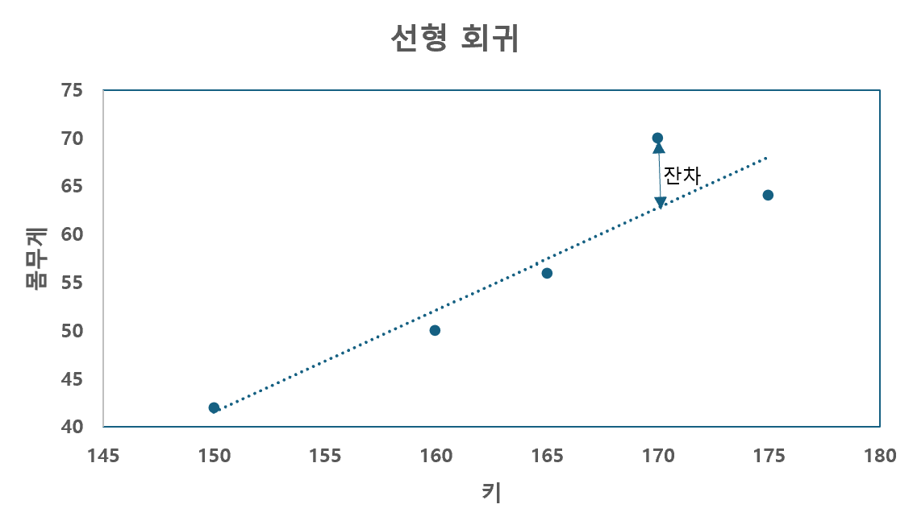
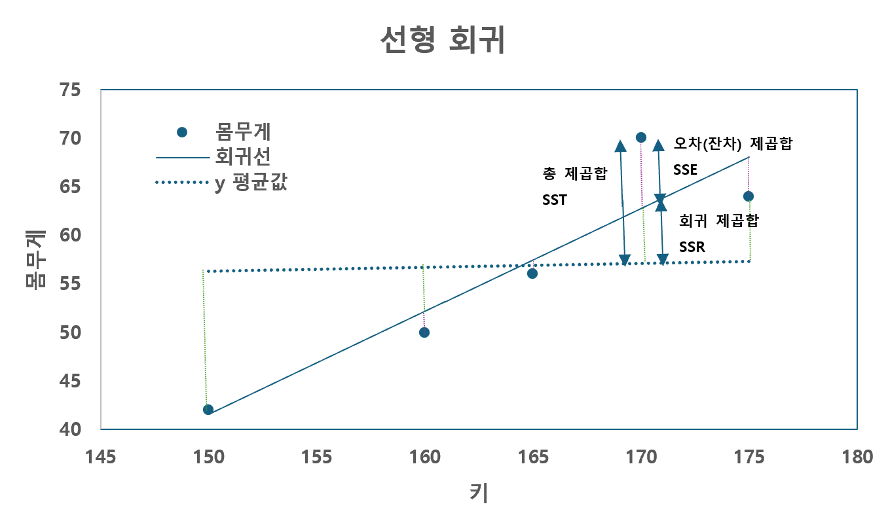
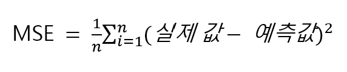

# CHAPTER04 회귀분석
- 수치형 변수 간의 관계 또는 Input(원인)과 Output(결과) 간의 관계를 추정하거나 예측하는 데 사용

  - 통계에서의 Input(원인) : 독립(independent) 변수
 
  - 통계에서의 Output(결과) : 종속(dependent) 변수

> ex
```
  회귀 모델은 빅분기 실기 학습 시간을 독립변수, 성적을 종속변수로 두고 학습 시간에 따라 시험 성적을 예측하는 것이 목적

  독립변수는 학습 시간 1개가 아니라 수험생 나이 등 2개 이상일 수도 있음
```

- 상관계수 : 변수 간의 강도와 방향을 측정하는 방법 (변수 간의 관계 파악)

  - 두 변수 간의 양의 상관관계, 음의 상관관계, 상관관계 없음을 확인
 
- 회귀모델(Regression Model) : Input(원인)과 Output(결과)의 관계를 설명하는 것

  - 선형 회귀모델 : 수치 변수 간의 인과 관계를 설명하는 대표적인 모델
 
    - 단순 선형 회귀 : 독립변수가 1개
   
      - 하나의 독립변수와 하나의 종속변수의 관계를 고려해 직선의 1차 방정식 찾아냄
     
      - y = ax + b (a : 기울기(회귀계수), b : y절편(상수항))
   
    - 다중 선형 회귀 : 독립변수가 2개 이상
   
      - 2개 이상의 독립변수 고려

<br>

SECTION01 상관계수(Correlation Coefficient)
---
- 두 변수 간의 선형적인 관계가 어느 정도 강한지를 나타냄

  - -1 ≤ r ≤ 1
 
  - r 이 1 에 가까울수록 강한 양의 선형관계 의미
 
  - r 이 0 에 가까울수록 약한 선형관계 의미
 
  - r 이 -1 에 가까울수록 강한 음의 선형관계 의미
 
- 연속형이 두 변수 간의 관계는 산점도를 통해 그래프로 그릴 수 있음 

|양(positive)의 상관관계)|음(negative)의 상관관계|
|:-:|:-:|
|||
|x 값이 증가함에 따라 y 값 증가|x 값이 증가함에 따라 y 값 감소|

<br>

### 01. 상관 계수
> 상관 계수를 구할 때는 판다스의 corr() 함수 사용
```python
  pandas.DataFrame.corr(method='pearson', numeric_only=False)
```
- method : 상관 관계 방법

  - pearson : 피어슨(기본값)
 
  - kendall : 켄달의 타우(Kendall's tau)
 
  - spearman : 스피어만
 
- numeric_only : 숫자 자료형만 포함 여부(기본값 False)

<br>

#### ✏️ 문제
> 다음은 학생들의 키와 몸무게 데이터다. 이를 바탕으로 상관 계수를 구하라.

|학생|키(cm)|몸무게(kg)|
|:-:|:-:|:-:|
|A|150|42|
|B|160|50|
|C|170|70|
|D|175|64|
|E|165|56|

<br>

> 코드
```python
  import pandas as pd
  
  # 주어진 데이터
  data = {
      '키' : [150, 160, 170, 175, 165],
      '몸무게' : [42, 50, 70, 64, 56]
  }
  
  df = pd.DataFrame(data)
  
  # 상관계수 계산
  correlation = df.corr()
  print(correlation)
```
- 판다스 데이터프레임에서 제공하는 corr() 함수를 활용하면 상관 계수 구할 수 있음

  - corr : correlation 약자

> 결과
```python
            키       몸무게
  키      1.000000  0.919509
  몸무게  0.919509  1.000000
```
- 같은 변수인 키의 상관계수, 몸무게와 몸무게의 상관 계수는 1

  - 키와 몸무게의 상관계수 : 0.919509

<br>

> 키와 몸무게의 상관관계 값만 출력하고자 한다면 iloc 활용
```python
  print(correlation.iloc[0,1])
```
- 키와 몸무게의 상관관계가 두 군데 있으므로 하나 선택

> 결과
```python
  0.9195090879163764
```

<br>

> 두 변수에 대한 상관관계만 구하기
```python
  print(df['키'].corr(df['몸무게']))
  print(df['몸무게'].corr(df['키']))
```
- df['컬럼'].corr(df['컬럼']) 방법 사용

  - 컬럼 순서 개의치 않음

> 결과
```python
  0.9195090879163765
  0.9195090879163765
```
- 결과 값이 소수 끝자리에서 다를 수도 있으나 일반적으로 문제에서는 소수 둘째~넷째 자리에서 반올림 처리하므로 영향 X

<br>

> method 파라미터
```python
  # 피어슨 상관계수(기본값)
  print(df.corr())
  
  # 스피어만 상관계수
  print(df.corr(method='spearman'))
  
  # 켄달의 타우 상관계수
  print(df.corr(method='kendall'))
```
- 판다스에서 기본적으로 피어슨(Pearson) 상관계수 계산

  - method 파라미터 활용해 다른 종류의 상관계수 계산 가능

> 결과
```python
              키       몸무게
  키      1.000000  0.919509
  몸무게  0.919509  1.000000
         키  몸무게
  키      1.0  0.9
  몸무게  0.9  1.0
         키  몸무게
  키      1.0  0.8
  몸무게  0.8  1.0
```

<br>

### 02. 두 변수의 상관계수와 t-검정
- 두 변수의 상관계수와 t-검정 결과 확인 가능

  - 일반적으로 t-검정을 묻는다면 피어슨 상관계수 값이 표준

> 코드
```python
  from scipy import stats
  
  # 피어슨 상관계수와 p-value 계산
  print(stats.pearsonr(df['몸무게'], df['키']))
  
  # 스피어만 상관계수와 p-value 계산
  print(stats.spearmanr(df['몸무게'], df['키']))
  
  # 켄달의 타우 상관계수와 p-value 계산
  print(stats.kendalltau(df['몸무게'], df['키']))
```

> 결과
```python
  PearsonRResult(statistic=0.9195090879163765, pvalue=0.027079456895589476)
  SignificanceResult(statistic=0.8999999999999998, pvalue=0.03738607346849874)
  SignificanceResult(statistic=0.7999999999999999, pvalue=0.08333333333333333)
```

<br>

---

<br>

SECTION02 단순 선형 회귀 분석
---
- 회귀 분석(Regression Analysis)

  - 2개 이상의 변수 간의 관계를 파악하려는 통계적 분석 방법
 
  - 원인과 결과 간의 관계를 수학적으로 모델링해 예측할 수 있도록 도와줌

- 단순 선형 회귀(Simple Linear Regression) 분석

  - 하나의 독립변수로부터 하나의 종속변수와의 관계를 분석하거나 예측하는 방법
 
- ex) 키워드 광고를 많이 하면 판매량이 어떻게 변할까?

  -  **독립변수(X)** : 원인을 나타내는 데이터 (키워드 광고)
 
  - **종속변수(y)** : 결과를 나타내는 데이터 (판매량)

<br>

### 01. 단순 회귀 분석과 다중 회귀 분석
- 회귀 분석의 유형 : 독립변수의 개수에 따라 달라짐

  - **단순 회귀 분석** : 독립변수(원인)가 하나일 때 (키워드 광고만으로 판매량 예측)
 
  - **다중 회귀 분석** : 독립변수(원인)가 여러 개일 때 (키워드 광고, 직원 수, 서비스로 판매량 예측)

<br>

<details>
  <summary>💡 머신러닝과 통계학 용어</summary>

<br>

- 머신러닝과 통계학에서 같은 개념을 다르게 표현하는 경우 有

|머신러닝|통계학|예시|
|:-:|:-:|:-:|
|X 데이터,<br>features(특징, 피처)|톡립변수,<br>설명변수|온도, 강수량, 습도, 시간, 평일/주말 등|
|y 데이터,<br>label,<br>target|종속변수,<br>반응변수,<br>결과변수|매출액, 주문량 등|


</details>

<br>


#### (1) 단순 선형 회귀식
```
  y = α + βX + ε
```
- X : 독립변수

- y : 종속변수

- α(알파) : 절편(상수항)

- β(베타) : 기울기(X를 1 증가시켰을 때 y의 증가량)

- ε(엡실론) : 오차항(모델이 설명하지 못하는 부분)

- X 와 y 를 가장 잘 나타내는 직선을 찾기 위해 β₀(y절편)와 β₁(기울기) 값 추정

<br>

#### (2) 단순 선형 회귀선
|키와 몸무게 데이터를 바탕으로 만든 회귀 모델을 시각화한 회귀선|
|-|
||
|- 이 회귀선은 데이터를 모두 설명하는 완벽한 직선을 만들 수는 없지만, 각 데이터를 잘 설명하는 가장 좋은 직선을 찾을 수 있음<br><br>- 예측된 회귀선과 실제 data 는 일치하지 않는 경우가 많은데, 이 실제 값과 예측값의 차이가 잔차(residual)<br><br>- 잔차가 0에 가깡루수록 회귀선ㅇ니 실제 값을 잘 설명한다고 할 수 있음|

<br>

- **최소제곱법(Ordinary Least Squares)**

  - 관측된 값과 회귀 모델의 예측값 간의 차이(잔차)의 제곱합을 최소화하는 것
 
  - 회귀 분석 모델을 만들 때 기본적으로 최소제곱법(OLS) 활용
 
  - 회귀 분석 실습에서는 statsmodels 의 ols() 함수 활용
 
    - ols 방법을 사용해 선형 회귀 모델 구축

- **ols 모델**

  - 최소제곱 선형 모델을 구축하는 데는 statsmodels 의 ols() 함수 사용
 
    - 종속변수와 하나 이상의 독립변수 간의 선형 관계를 모델링하는 데 사용됨
   
  - statsmodels 의 ols() 함수 중 R 스타일(formula, 공식)로 사용 가능한 ols() 함수 사용

```python
  ols('종속변수~독립변수', data=df).fit()
```
- 종속변수와 독립변수 사이에는 물결(~) 표시 사용

  - 주의 : df['컬럼명'] 이 아니라 컬럼명만 작성
 
- 종속변수 : 모델에서 예측하려는 변수 (ex. 작업형2 에서 target 데이터)

- 독립변수 : 종속변수에 영향을 미치는 독립적인 변수 (ex. 작업형2 에서 target 을 제외한 train 데이터)

- data=df : df 에서 변수를 찾아 사용하도록 데이터 연결

- \.fit() : ols 모델을 주어진 데이터에 학습(적합)시킴

<br>

<details>
  <summary>💡 R 스타일 사용 이유</summary>

<br>

- 작업형2에서 사용하는 학습(fit) 방식과 유사한 statsmodels.api 의 OLS 有

  - 상수항(절편)을 수동으로 직접 처리(코딩)해야 하는 번거로움 존재
 
- 상수항을 자동으로 처리해주는 statsmodels.formula.api 의 ols 사용, formula 는 R 스타일 사용

|구분|주의|특징|
|:-:|:-:|:-:|
|statsmodels.formula.api 의 ols<br>(함수)|소문자로 사용<br>ols()|R 스타일의 공식을 사용해 모델을 생성하고, 결과를 분석<br>ols(종송변수 ~ 독립변수1 + 독립변수2, data=df)|
|statsmodles.api 의 OLS<br>(클래스)|대문자로 사용<br>OLS()|작업형2에서 사용했던 model.fit(X, y) 방식과 유사<br>단, OLS(y, X).fit() 로 순서가 다름<br>OLS(종속변수, 독립변수 데이터프레임)|


</details>

<br>


- **제곱합**

  - 선형 회귀에서 제곱합(Sum of Squares)은 모델이 데이터를 잘 설명하는가(적합도)를 평가하는 데 사용
 
  - 선형 회귀는 최소제곱법 적용
 
    - 최소제곱법 : SSE 를 최소화하는 회귀 계수를 찾는 것

|용어(영문)|용어(해석)|의미|
|:-:|:-:|:-:|
|SST<br>(Sum of Squares Total)|총 제곱합|각 관측치가 평균으로부터 얼마나 떨어져 있는지를 나타냄<br>SST = SSR + SSE|
|SSR<br>(Sum of Squares for Regression)|회귀 제곱합|회귀선이 평균으로부터 얼마나 떨어져 있는지를 나타냄|
|SSE<br>(Sum of Squares for Error)|오차 제곱합<br>(잔차 제곱합)|관측치가 회귀선으로부터 얼마나 떨어져 있는지를 나타냄|

|-|
|-|
||

<br>

- **결정계수(R-squared)**

  - 모델이 그 데이터를 얼마나 잘 설명하느냐를 나타내는 통계값
 
  - 머신러닝(작업형2) 회귀 평가지표 중에 결정 계수(R²) 구하는 방법
 
    - R² = SSR / SST
   
      - 1 에 가까울수록 데이터를 잘 설명한다는 뜻
     
      - 0 에 가깝거나 음수가 나오는 경우 모델이 데이터를 잘 설명하지 못한다는 뜻

<br>

#### ✏️ 문제
> 다음은 20명의 키와 몸무게에 관한 정보다. 이 데이터를 바탕으로 회귀 모델을 구축하고 각 소문제의 값을 구하시오.

> 코드
```python
  import pandas as pd
  
  data = {
      '키' : [150, 160, 170, 175, 165, 155, 172, 168, 174, 158, 162, 173, 156, 159, 167, 163, 171, 169, 176, 161],
      '몸무게' : [42, 50, 70, 64, 56, 48, 68, 60, 65, 52, 54, 67, 49, 51, 58, 55, 69, 61, 66, 53]
  }
  
  df = pd.DataFrame(data)
```

<br>

**1. 주어진 데이터로 최소제곱법을 이용한 단순 선형 회귀 모델을 구축하고 통계적 요약 출력**
> 코드
```python
  from statsmodels.formula.api import ols
  model = ols('키 ~ 몸무게', data=df).fit()
  print(model.summary())
```
- statsmodels.formula.api 에서 ols() 함수 불러오기

- 키는 종속변수, 몸무게는 독립변수로 설정하고 선형 회귀 모델 생성

- R 스타일은 종속변수가 먼저 온다는 점에 유의

- model.summary() 함수 : 통계적 요약 결과 확인 가능

> 결과
```python
                              OLS Regression Results                            
  ==============================================================================
  Dep. Variable:                      키   R-squared:                       0.892
  Model:                            OLS   Adj. R-squared:                  0.886
  Method:                 Least Squares   F-statistic:                     148.0
  Date:                Mon, 18 Nov 2024   Prob (F-statistic):           4.04e-10
  Time:                        09:44:49   Log-Likelihood:                -45.761
  No. Observations:                  20   AIC:                             95.52
  Df Residuals:                      18   BIC:                             97.51
  Df Model:                           1                                         
  Covariance Type:            nonrobust                                         
  ==============================================================================
                   coef    std err          t      P>|t|      [0.025      0.975]
  ------------------------------------------------------------------------------
  Intercept    115.0676      4.158     27.671      0.000     106.331     123.804
  몸무게         0.8658      0.071     12.167      0.000       0.716       1.015
  ==============================================================================
  Omnibus:                        0.985   Durbin-Watson:                   2.609
  Prob(Omnibus):                  0.611   Jarque-Bera (JB):                0.336
  Skew:                          -0.315   Prob(JB):                        0.845
  Kurtosis:                       3.082   Cond. No.                         432.
  ==============================================================================
  
  Notes:
  [1] Standard Errors assume that the covariance matrix of the errors is correctly specified.
```
- 몸무게의 기울기 : coef 0.8658

- 절편(Intercept)의 기울기 : coef 115.0676

- 결정 계수 : R-squared 0.892

- 몸무게의 p-value : 0.000 (0에 가까운 값으로 정확한 값은 별도 출력 필요)

<br>

<details>
  <summary>💡 모델의 요약 결과 설명</summary>

<br>

|용어|의미|
|:-:|-|
|Dep. Variable|종속변수|
|R-squared|결정 계수|
|Adj. R-squared|조정된 결정 계수|
|Method|사용된 방법 ⇒ 'Least Sqaures(최소제곱법)'|
|F-statistic|F-통계량|
|Prob (F-statistic)|F-통계량의 유의확률, 일반적으로 0.05 이하의 회귀 모델이 유의미함|
|Log-Likelihood|로그 우도(모델의 적합도, 최대화하는 것이 좋음)|
|AIC & BIC|모델의 적합도와 복잡성 사이의 균형을 평가하는 척도, 작은 값이 더 좋은 모델을 의미함|
|No. Observations|관측치 수(데이터 수)|
|Df Residuals|잔차의 자유도|
|Df Model|모델의 자유도|
|Covariance Type|공분산 유형|
|coef|각 변수의 계수 ⇒ 'Intercept' 는 상수항(절편), '몸무게'는 몸무게의 계수(기울기)를 나타냄|
|std err|계수의 표준 오차|
|t|t 통계량(검정 통계량|
|P>\|t\||각 계수의 t 통계량에 대한 p-value|
|[0.025 0.975]|95% 신뢰 구간, 각 계수에 대한 95% 신뢰 구간|


</details>

<br>

**2. 회귀 모델의 결정 계수 구하기**
- model.summary() 함수 값을 확인하는 방법 or 별도 값만 출력

> 별도 값만 출력
```python
  print('결정계수 :', model.rsquared)
```

> 결과
```python
  결정계수 : 0.8915914350087262
```

<br>

**3. 회귀 모델에서 회귀 계수(기울기와 절편) 구하기**
- model.params 활용해 model.summary() 함수에 있는 coef 값 출력 가능

> 코드
```python
  print('기울기 :', model.params['몸무게'])
  print('절편 :', model.params['Intercept'])
```

> 결과
```python
  기울기 : 0.8658438852380215
  절편 : 115.0676390447185
```

<br>

**4. 회귀 모델에서 몸무게의 회귀 계수가 통계적으로 유의한지 검정했을 때의 p-value 구하기**
- 결과가 지수 표기법으로 출력되어 일반 표기법으로 변경

  - 방법1 : print(format(변경할 값 또는 변수명, '.10f'))
 
  - 방법2 : print('{:.10f}'.format(변경할 값 또는 병수명))
 
> 코드
```python
  print('p-value :', model.pvalues['몸무게'])
  print('p-value :', '{:.10f}'.format(model.pvalues['몸무게']))
```

> 결과
```python
  p-value : 4.0379325599303475e-10
  p-value : 0.0000000004
```

<br>

**5. 회귀 모델을 사용해 몸무게가 67일 때의 예측 키 구하기**
- 새로운 데이터를 학습할 때 사용했던 데이터와 동일한 컬럼명으로 데이터프레임 형태 만들고 model.predict() 함수 사용

- 예측한 결과는 시리즈 형태로 값만 출력하기 위해 [0] 추가

> 코드
```python
  new_data = pd.DataFrame({'몸무게' : [67]})
  result = model.predict(new_data)
  print('몸무게가 67일 때의 예측 키 :', result[0])
```

> 결과
```python
  몸무게가 67일 때의 예측 키 : 173.07917935566593
```

<br>

**6. 회귀 모델의 잔차 제곱합 구하기**
- 잔차 : '실제(관측) 값 - 모델' 로 예측된 값

- 잔차 먼저 구하기

  - 모델로 예측된 값을 구할 때 predict(df['몸무게']) 대신 predict(df) 그대로 넣더라도 모델이 자동으로 독립변수 구분
 
- 잔차를 제곱한 값 모두 더가히

  - sum() 함수는 (df['잔차'] ** 2).sum() 형태로 사용해도 결과는 같음

> 코드
```python
  df['잔차'] = df['키'] - model.predict(df)
  print('잔차 제곱합 :', sum(df['잔차']**2))
```

> 결과
```python
  잔차 제곱합 : 113.74226638884441
```

<br>

**7. 회귀 모델의 MSE 구하기**
- MSE : 평균 제곱 오차(Mean Squared Error), 잔차들의 평균

|-|
|-|
||

> 코드
```python
  df['잔차'] = df['키'] - model.predict(df)
  MSE = (df['잔차']**2).mean()
  print('MSE :', MSE)
```

> 결과
```python
  MSE : 5.68711331944222
```

<br>

> 사이킷런에서 제공하는 MSE 평가지표 결과
```python
  from sklearn.metrics import mean_squared_error
  pred = model.predict(df['몸무게'])
  mse = mean_squared_error(df['키'], pred)
  print('MES :', mse)
```

> 결과
```python
  MSE : 5.68711331944222
```
- 직접 계산한 MSE 와 결과가 같음

<br>

<details>
  <summary>💡 부동 소수점 연산</summary>

<br>

- 직접 잔차를 계산한 MSE 와 사이킷런의 MSE 결과에 미세한 차이가 있을 수도 있음

  - 보통 소수점 끝자리에서 다름
 
- 차이는 매우 미미하며, 실제 시험에서 문제가 출제된다면 정답이 동일하게 소수 0~6 자리에서 반올림 처리

- 부동 소수점 연산의 미세한 불일치로 인해 발생

  - 부동 소수점 : 컴퓨터에서 소수점이 있는 숫자를 표현하고 연산하는 방식


</details>

<br>


#### ✏️ 심화
**1. 몸무게의 95% 신뢰 구간 구하기**
- model.summary() 함수로 확인 가능

- alpha 기본값은 0.05(95%)

  - 만약 문제에서 90% 신뢰 구간 구하라고 한다면 alpha 를 0.1 로 변경 가능
 
> 코드
```python
  print('신뢰구간 :\n', model.conf_int(alpha=0.05).loc['몸무게'])
```

> 결과
```python
  신뢰구간 :
  0    0.716337
  1    1.015351
  Name: 몸무게, dtype: float64
```

<br>

**2. 몸무게가 50일 때 예측 키의 신뢰 구간과 예측 구간 구하기**
- 몸무게가 50일 때 get_prediction() 함수를 사용해 예측값 및 예측 구간 구하기

- summary_frame() 함수를 사용해 예측 결과 요약

  - alpha=0.05(기본값) : 95% 신뢰수준 의미

> 코드
```python
  new_data = pd.DataFrame({'몸무게' : [50]})
  pred = model.get_prediction(new_data)
  result = pred.summary_frame(alpha=0.05)
  print('예측값의 신뢰구간과 예측구간 :\n', result)
```

> 결과
```python
  예측값의 신뢰구간과 예측구간 :
            mean   mean_se  mean_ci_lower  mean_ci_upper  obs_ci_lower  \
  0  158.359833  0.794986      156.68963     160.030037    152.820798   
  
     obs_ci_upper  
  0    163.898869  
```
- mean_ci_lower, mean_ci_upper : 예측 키의 95% 신뢰 구간의 하한과 상한 의미

- obs_ci_lower, obs_ci_upper : 예측 구간의 하한과 상한 의미

<br>

---

<br>

SECTION03 다중 선형 회귀 분석(Multiple Linear Regression)
---
- 2개 이상의 독립변수와 하나의 종속변수 간의 관계를 분석하는 방법

- 중선형 회귀 분석이라고도 함

- 단순 선형 회귀 분석과 다중 선형 회귀 분석은 독립변수 개수만 다를 뿐, 분석 방법에는 큰 차이가 없음

> 다중 선형 회귀식
```
  y = α + β₁X + β₂X + β₃X + ε
```
- y : 종속변수

- X : 독립변수

- α(알파) : 절편(상수항)

- β(베타) : 기울기

- ε(엡실론) : 오차항(직선이 설명하지 못하는 변동, 정규 분포를 따름)

- 종속변수를 가장 잘 설명하는 회귀 계수들을 추정함

  - 회귀 계수 : 기울기, 절편 등

<br>

#### ✏️ 문제
> 다음은 매출액, 광고비, 직원 수에 관한 데이터다. 광고비와 직원 수는 독립변수고, 매출액은 종속변수다.<br>
> 다중 선형 회귀 모델을 구축하고 각 소문제의 값을 구하시오.

> 코드
```python
  import pandas as pd
  
  data = {
      '매출액' : [300, 320, 250, 360, 315, 328, 310, 335, 326, 280, 290, 300, 315, 328, 310, 335, 300, 400, 500, 600],
      '광고비' : [70, 75, 30, 80, 72, 77, 70, 82, 70, 80, 68, 90, 72, 77, 70, 82, 40, 20, 75, 80],
      '직원수' : [15, 16, 14, 20, 19, 17, 16, 19, 15, 20, 14, 5, 16, 17, 16, 14, 30, 40, 10, 50]
  }
  
  df = pd.DataFrame(data)
  print(df.head(3))
```

> 결과
```python
     매출액  광고비  직원수
  0  300   70   15
  1  320   75   16
  2  250   30   14
```

<br>

**1. 주어진 데이터로 최소제곱법을 이용한 다중 선형 회귀 모델을 구축하고 통계적 요약 출력**
- statsmodel 의 ols() 함수 활용해 회귀 모델 생성 후 종속변수와 독립변수를 활용해 학습

- 독립변수가 여러 개일 때는 플러스(+) 사용해 formula 를 '매출액 ~ 광고비 + 직원 수' 로 작성

> 코드
```python
  from statsmodels.formula.api import ols
  model = ols('매출액 ~ 광고비 + 직원수', data=df).fit()
  print(model.summary())
```

> 결과
```python
                              OLS Regression Results                            
  ==============================================================================
  Dep. Variable:                  매출액   R-squared:                       0.512
  Model:                            OLS   Adj. R-squared:                  0.454
  Method:                 Least Squares   F-statistic:                     8.907
  Date:                Mon, 18 Nov 2024   Prob (F-statistic):            0.00226
  Time:                        11:03:53   Log-Likelihood:                -108.22
  No. Observations:                  20   AIC:                             222.4
  Df Residuals:                      17   BIC:                             225.4
  Df Model:                           2                                         
  Covariance Type:            nonrobust                                         
  ==============================================================================
                   coef    std err          t      P>|t|      [0.025      0.975]
  ------------------------------------------------------------------------------
  Intercept    101.0239     71.716      1.409      0.177     -50.284     252.331
  광고비          1.8194      0.807      2.255      0.038       0.117       3.522
  직원수          5.9288      1.430      4.147      0.001       2.912       8.945
  ==============================================================================
  Omnibus:                       30.534   Durbin-Watson:                   1.354
  Prob(Omnibus):                  0.000   Jarque-Bera (JB):               64.655
  Skew:                           2.444   Prob(JB):                     9.13e-15
  Kurtosis:                      10.327   Cond. No.                         401.
  ==============================================================================
  
  Notes:
  [1] Standard Errors assume that the covariance matrix of the errors is correctly specified.
```

<br>

<details>
  <summary>💡 model.summary() 함수에서 n>=20 관련 워닝 발생</summary>

<br>

- 표본의 크기가 20개 미만이라면 발생할 수 있는 워닝

  - 무시하고 진행해도 괜찮음

</details>

<br>

**2. 광고비와 매출액의 상관 계수 구하기**
- corr() 함수를 활용해 상관 계수 구하기

> 코드
```python
  print('상관계수 :', df['광고비'].corr(df['매출액']))
```

> 결과
```python
  상관계수 : 0.13316981737040343
```

<br>

**3. 광고비와 매출액의 t-검정의 p-value 구하기**
- 일반적으로 상관 계수를 묻는 문제라면 피어슨 상관 계수와 t-검정 결과를 의미

> 코드
```python
  from scipy import stats
  print(stats.pearsonr(df['광고비'], df['매출액']))
```

> 결과
```python
  PearsonRResult(statistic=0.13316981737040343, pvalue=0.5756778801904272)
```

<br>

**4. 회귀 모델의 결정 계수 구하기**
- 모델의 결정 계수는 model.summary() 함수로도 확인 가능

> 코드
```python
  print('결정계수(R-squared) :', model.rsquared)
```

> 결과
```python
  결정계수(R-squared) : 0.5116964327009044
```

<br>

**5. 회귀 모델에서 회귀 계수(기울기와 절편) 구하기**
- 회귀 계수는 model.summary() 함수로도 확인 가능

> 코드
```python
  print('회귀계수 :\n', round(model.params))
```

> 결과
```python
  회귀계수 :
  Intercept       101.0
  광고비            2.0
  직원수            6.0
  dtype: float64
```
- 절편 : 101.0

- 광고비 기울기 : 2.0

- 직원수 기울기 : 6.0

<br>

**6. 회귀 모델에서 광고비의 회귀 계수가 통계적으로 유의한지 검정했을 때의 p-value**
- 광고비 회귀 계수의 p-value 는 model.summary() 함수로도 확인 가능

> 코드
```python
  print('p-value :', model.pvalues['광고비'])
```

> 결과
```python
  p-value : 0.037643506476960256
```

<br>

**7. 광고비 50, 직원수 20인 데이터가 있을 때 구축한 회귀 모델에서의 예상 매출액**
- 주어진 데이터를 데이터프레임으로 생성 후 앞서 만든 모델을 사용해 예측

  - 반드시 기존 데이터와 컬럼명이 같아야 함
 
- 결과값은 시리즈 형태로 반환

> 코드
```python
  new_data = pd.DataFrame({
      '광고비' : [50],
      '직원수' : [20]
  })
  result = model.predict(new_data)
  print('새로운 데이터의 매출액 :', result)
```

> 결과
```python
  새로운 데이터의 매출액 : 0    310.57033
  dtype: float64
```

<br>

**8. 회귀 모델의 잔차의 제곱합 구하기**
- 실제 값에서 예측값을 빼면 잔차가 나오고, 그 값을 제곱한 후 모두 던하면 잔차 제곱합

> 코드
```python
  df['잔차'] = df['매출액'] - model.predict(df)
  print('잔차 제곱합 :', sum(df['잔차']**2))
```

> 결과
```python
  잔차 제곱합 : 58686.17827156106
```

<br>

<details>
  <summary>💡 잔차 구하는 방법</summary>

<br>

- df['매출액'] - model.predict(df) 대신 statsmodels 에서 제공하는 resid 활용 가능

> model.resid 를 제곱한 값을 모두 더해 잔차 제곱합 구하기

> 코드
```python
  print(sum(model.resid**2))
```

> 결과
```python
  58686.17827156106
```

</details>

<br>

**9. 회귀 모델의 MSE 구하기**
- MSE : 평균 제곱 오차

> 코드
```python
  MSE = (df['잔차']**2).mean()
  print('MSE :', MSE)
```

> 결과
```python
  MSE : 2934.308913578053
```

<br>

**10. 각 변수별 95% 신뢰 구간 구하기**
- 각 변수별 95% 신뢰 구간은 model.summary() 함수로도 확인 가능

- 정확한 값 또는 95% 가 아닌 다른 값을 확인하기 위해서는 model.conf_int(alpha=0.05) 사용

  - alpha=0.05 : 95% 의미
 
  - alpha=0.1 : 90% 의미

> 코드
```python
  print('95% 신뢰구간 :\n', model.conf_int(alpha=0.05))
```

> 결과
```python
  95% 신뢰구간 :
                      0           1
  Intercept   -50.283684  252.331429
  광고비         0.116785    3.522069
  직원수         2.912406    8.945105
```

<br>

**11. 광고비 45, 직원수 22일 때 95% 신뢰 구간과 예측 구간 구하기**
- get_prediction() 함수와 summary_frame() 함수를 사용해 예측값과 신뢰 구간, 예측 구간 구하기

  - mean_ci_lower, mean_ci_upper : 95% 신뢰 구간 하한 및 상한 의미
 
  - obs_ci_lower, obs_ci_upper : 예측 구간 하한 및 상한 의미

> 코드
```python
  new_data = pd.DataFrame({
      '광고비' : [45],
      '직원수' : [22]
  })
  pred = model.get_prediction(new_data)
  result = pred.summary_frame(alpha=0.05)
  print('예측값의 신뢰구간과 예측구간 :\n', result)
```

> 결과
```python
  예측값의 신뢰구간과 예측구간 :
            mean    mean_se  mean_ci_lower  mean_ci_upper  obs_ci_lower  \
  0  313.330707  22.502058     265.855514       360.8059     180.58875   
  
     obs_ci_upper  
  0    446.072663  
```

<br>

---

<br>

SECTION04 범주형 변수
---
- 회귀 분석에서 독립변수로 수치형 변수와 범주형 변수를 함께 사용할 때

  - 범주형 변수는 통상적으로 원-핫 인코딩(One-Hot Encoding) 같은 방법을 사용해 수치화
 
    - 범주형 변수의 각 범주를 대표하는 새로운 이진(0 또는 1) 변수를 생성하는 과정
   
    - 변환한 변수들은 회귀 모델에서 독립변수로 사용 가능
   
<br>

### 01. 범주형 변수 자동 원-핫 인코딩
- 스태츠모델(statsmodels)의 ols() 함수

  - 회귀 모델 생성 시 범주형 변수가 포함되어 있으면 이를 자동으로 인식하고 내부적으로 원-핫 인코딩 처리 진행
 
  - 사용자가 별도로 범주형 변수를 수치형으로 변환하는 작업 없이도 모델 생성 가능

<br>
 
> 코드
```python
  import pandas as pd
  import statsmodels.api as sm
  df = pd.read_csv('./data/study.csv')
  df.head()
```

> 결과

<div>
<table border="1" class="dataframe">
  <thead>
    <tr style="text-align: right;">
      <th></th>
      <th>study_hours</th>
      <th>material_type</th>
      <th>score</th>
    </tr>
  </thead>
  <tbody>
    <tr>
      <th>0</th>
      <td>71</td>
      <td>강의</td>
      <td>95</td>
    </tr>
    <tr>
      <th>1</th>
      <td>34</td>
      <td>독학</td>
      <td>63</td>
    </tr>
    <tr>
      <th>2</th>
      <td>91</td>
      <td>도서</td>
      <td>95</td>
    </tr>
    <tr>
      <th>3</th>
      <td>80</td>
      <td>독학</td>
      <td>80</td>
    </tr>
    <tr>
      <th>4</th>
      <td>40</td>
      <td>강의</td>
      <td>79</td>
    </tr>
  </tbody>
</table>
</div>

<br>

- 불러온 데이터의 변수 : study_hours(학습 시간), material_type(학습 자료 유형), score(점수)

  - material_type 변수는 범주형 (강의, 독학, 독서)
 
<br>

> 종속변수 score, 독립변수 study_hours, material_type 사용해 회귀 모델 생성
```python
  from statsmodels.formula.api import ols
  model = ols('score ~ study_hours + material_type', data=df).fit()
  print(model.summary())
```
- material_type 범주형 변수는 별도의 처리 없이 ols() 함수를 사용해 모델에 포함시킴

> 결과
```python
                              OLS Regression Results                            
  ==============================================================================
  Dep. Variable:                  score   R-squared:                       0.969
  Model:                            OLS   Adj. R-squared:                  0.968
  Method:                 Least Squares   F-statistic:                     991.9
  Date:                Mon, 18 Nov 2024   Prob (F-statistic):           4.42e-72
  Time:                        15:23:25   Log-Likelihood:                -238.89
  No. Observations:                 100   AIC:                             485.8
  Df Residuals:                      96   BIC:                             496.2
  Df Model:                           3                                         
  Covariance Type:            nonrobust                                         
  =======================================================================================
                            coef    std err          t      P>|t|      [0.025      0.975]
  ---------------------------------------------------------------------------------------
  Intercept              59.2111      0.799     74.147      0.000      57.626      60.796
  material_type[T.도서]    -8.6696      0.678    -12.778      0.000     -10.016      -7.323
  material_type[T.독학]   -17.6129      0.634    -27.790      0.000     -18.871     -16.355
  study_hours             0.4839      0.011     43.810      0.000       0.462       0.506
  ==============================================================================
  Omnibus:                        1.754   Durbin-Watson:                   2.173
  Prob(Omnibus):                  0.416   Jarque-Bera (JB):                1.216
  Skew:                           0.231   Prob(JB):                        0.544
  Kurtosis:                       3.280   Cond. No.                         228.
  ==============================================================================
  
  Notes:
  [1] Standard Errors assume that the covariance matrix of the errors is correctly specified.
```
- 결정 계수(R-squared) : 0.969

  - 모델은 전체 변동의 약 96.9% 설명하고 있음
 
- 회귀 계수(Coefficients)에서 절편(Intercept) : 59.2111

  - 다른 모든 변수들이 0일 때의 예상 점수
 
  - 이 값은 '강의'에 해당됨
 
- '강의'를 사용한 경우의 예상 점수 : Intercept(절편) = 59.21

- '도서'를 사용한 경우의 예상 점수 : Intercept + material_type_도서의 계수 = 59.21 - 8.67 = 50.54

- '독학'을 사용한 경우의 예상 점수 : Intercept + material_type_독학의 계수 = 59.21 - 17.61 = 41.60

- 도서와 독학의 예상 점수를 각각 계산할 수 있는 이유는 동시에 1의 값을 갖는 경우는 없기 때문

- study_hours : 회귀 계수가 약 0.484 로 공부 시간이 1시간 증가할 때마다 점수는 약 0.494 점 증가

- material_type_도서 : 약 -8.67 로 공부 자료 유형이 '도서'인 경우 '강의'에 비해 점수가 약 8.67 점 낮음

- material_type_독학 : 약 -17.61 로 공부 자료 유형이 '독학'인 경우 '강의'에 비해 점수가 약 17.61 점 낮음

- 모든 독립변수들의 p-value 가 0.05 보다 작으므로 통계적으로 유의미함

<br>

<details>
  <summary>💡 원-핫 인코딩된 변수(컬럼)는 왜 2개(도서, 독학)일까?</summary>

<br>

- 판다스의 pd.get_dummies() 활용해 원-핫 인코딩 가능

  - 주의 : 회귀 모델에서 다중공선성(독립변수들 간의 높은 상관관계가 존재하는 현상) 문제 방지
 
    - 첫 번째 카테고리를 제외한 카테고리 -1 개로 변수를 생성 (drop+first = True)
   
    - ex) pd.get_dummies(df, drop_first=True)

</details>

<br>

### 02. 숫자로 표현된 범주형 변수 처리
- 회귀 분석에서 범주형 변수가 숫자로 표현되어 있는 경우에는 주의 필요

  - 숫자로 표현된 범주형 변수를 적절히 처리하는 것이 중요

- 숫자로 된 범주형 변수를 회귀 모델에 직접 입력시 모델은 이 변수를 연속현 수치 변수로 오해하고 분석 가능성 有

  - 변수의 실제 의미와 다르게 처리되어 분석 결과에 오류 초래
 
- 작업형3은 정답이 있는 문제이므로 문제에서 범주형 변수라고 알려 줄 때만 수동변환

  - **범주형 변수 자동 인식**
 
    - statsmodels 의 ols() 함수는 문자열로 된 범주형 변수를 자동으로 인식하고, 원-핫 인코딩 수행
   
    - 변수가 숫자로 되어 있는 경우에는 자동 인식과 처리가 이루어지지 않음
 
  - **수동 변환**
 
    - 숫자로 된 범주형 변수를 statsmodels 에서 범주형으로 처리하려면 사용자가 변수를 명시적으로 범주형(C())으로 변환

<br>

> ols() 함수 내에서 모델 공식 작성
```python
  # material_type 이 강의, 도서, 독학이 아닌 종류(숫자) 1, 2, 3 인 경우
  ols('score ~ study_hours + C(material_type)', data=df).fit()
```
- c(변수명) 구문 사용해 숫자 범주형 변수를 범주형으로 명시 가능

<br>

<details>
  <summary>💡 숫자로 표현된 범주형 변수인지 판단하는 방법</summary>

<br>

- 시험에서 숫자로 표현된 범주형 변수인지 아닌지 판단하는 것은 시험문제

  - 문제에서 명확하게 설명하거나 문제에서 범주형 변수로 인식할 수 있는 근거가 있다면 범주형 변수로 판단

</details>

<br>


