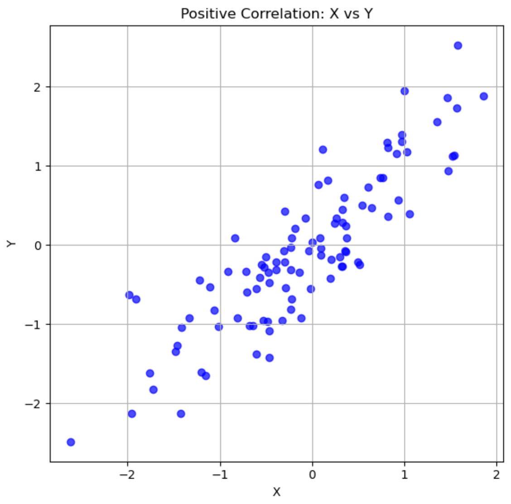
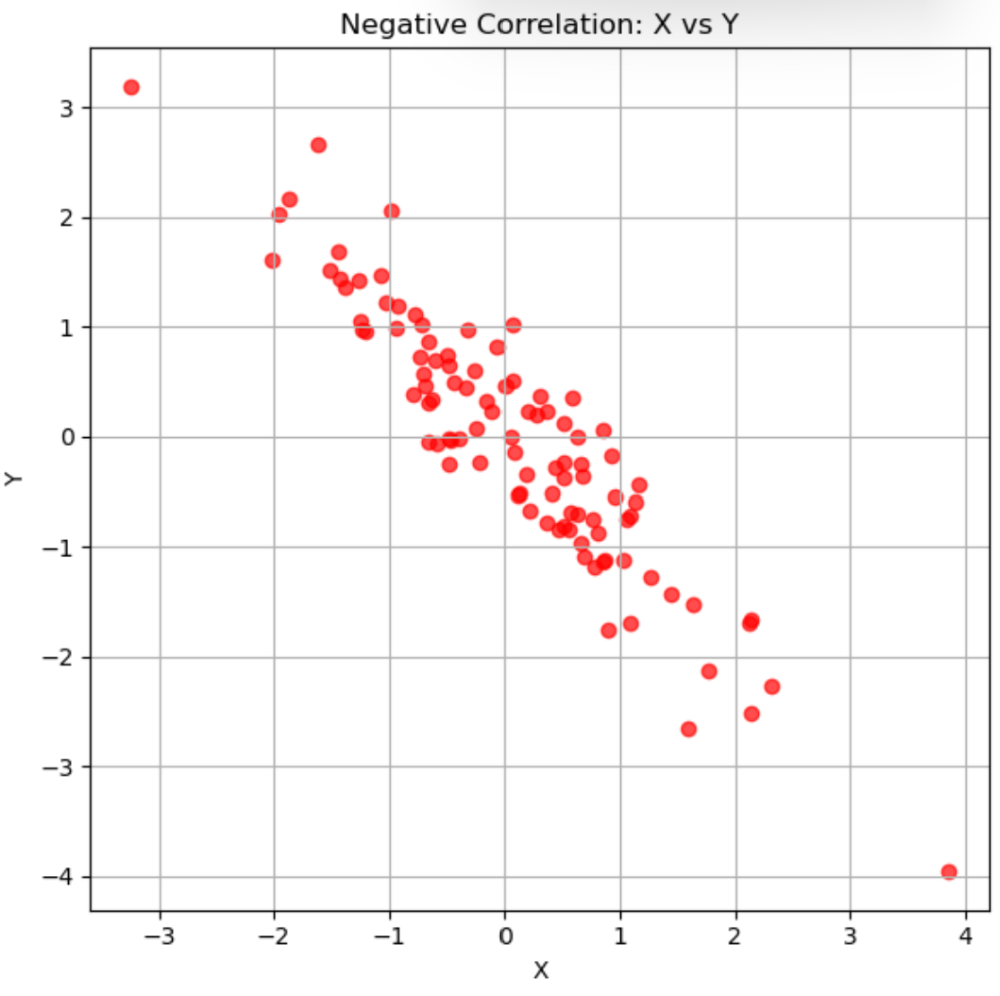

# CHAPTER04 회귀분석
- 수치형 변수 간의 관계 또는 Input(원인)과 Output(결과) 간의 관계를 추정하거나 예측하는 데 사용

  - 통계에서의 Input(원인) : 독립(independent) 변수
 
  - 통계에서의 Output(결과) : 종속(dependent) 변수

> ex
```
  회귀 모델은 빅분기 실기 학습 시간을 독립변수, 성적을 종속변수로 두고 학습 시간에 따라 시험 성적을 예측하는 것이 목적

  독립변수는 학습 시간 1개가 아니라 수험생 나이 등 2개 이상일 수도 있음
```

- 상관계수 : 변수 간의 강도와 방향을 측정하는 방법 (변수 간의 관계 파악)

  - 두 변수 간의 양의 상관관계, 음의 상관관계, 상관관계 없음을 확인
 
- 회귀모델(Regression Model) : Input(원인)과 Output(결과)의 관계를 설명하는 것

  - 선형 회귀모델 : 수치 변수 간의 인과 관계를 설명하는 대표적인 모델
 
    - 단순 선형 회귀 : 독립변수가 1개
   
      - 하나의 독립변수와 하나의 종속변수의 관계를 고려해 직선의 1차 방정식 찾아냄
     
      - y = ax + b (a : 기울기(회귀계수), b : y절편(상수항))
   
    - 다중 선형 회귀 : 독립변수가 2개 이상
   
      - 2개 이상의 독립변수 고려

<br>

SECTION01 상관계수(Correlation Coefficient)
---
- 두 변수 간의 선형적인 관계가 어느 정도 강한지를 나타냄

  - -1 ≤ r ≤ 1
 
  - r 이 1 에 가까울수록 강한 양의 선형관계 의미
 
  - r 이 0 에 가까울수록 약한 선형관계 의미
 
  - r 이 -1 에 가까울수록 강한 음의 선형관계 의미
 
- 연속형이 두 변수 간의 관계는 산점도를 통해 그래프로 그릴 수 있음 

|양(positive)의 상관관계)|음(negative)의 상관관계|
|-|-|
|||
|x 값이 증가함에 따라 y 값 증가|x 값이 증가함에 따라 y 값 감소|

<br>

---

<br>

SECTION02 단순 선형 회귀 분석
---


<br>

---

<br>

SECTION03 다중 선형 회귀 분석
---


<br>

---

<br>

SECTION04 범주형 변수
---


<br>


